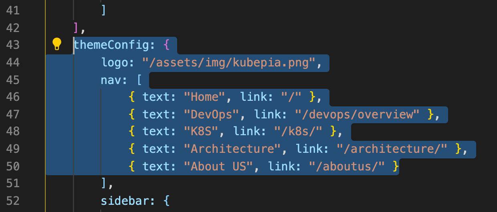
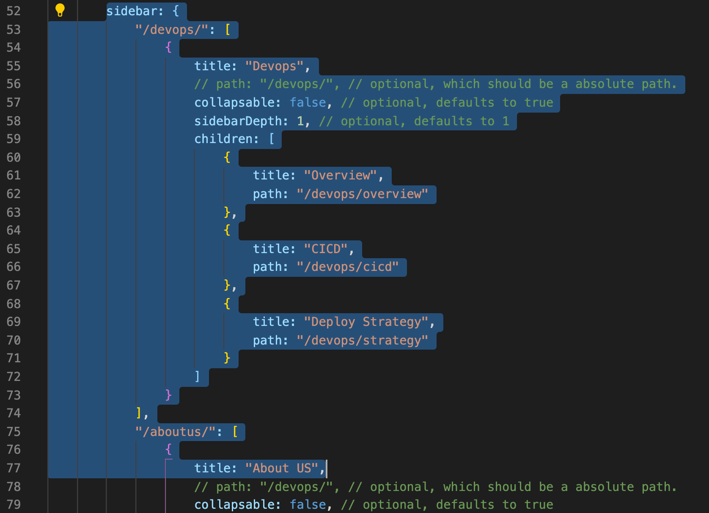
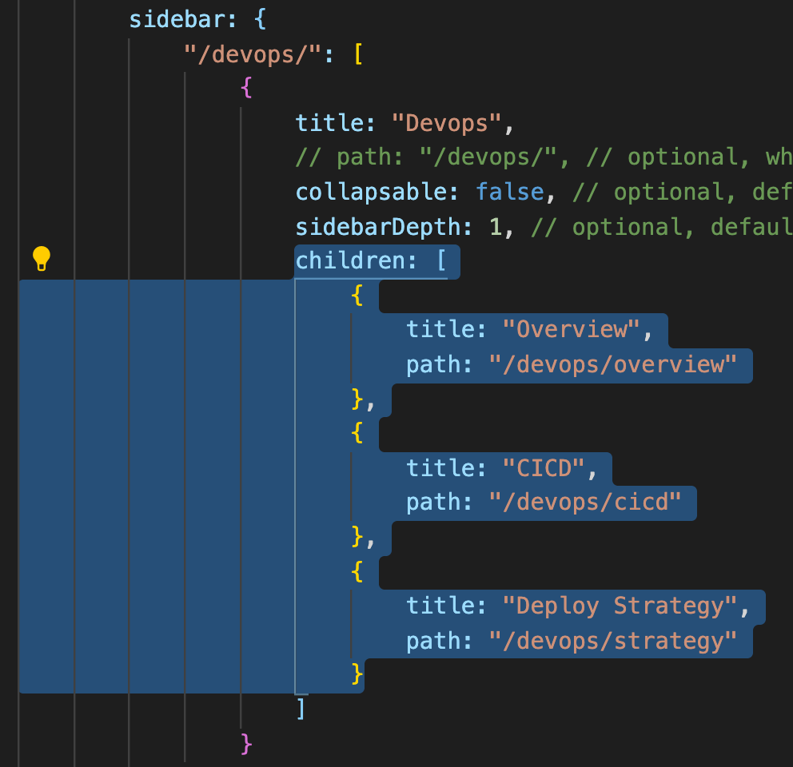
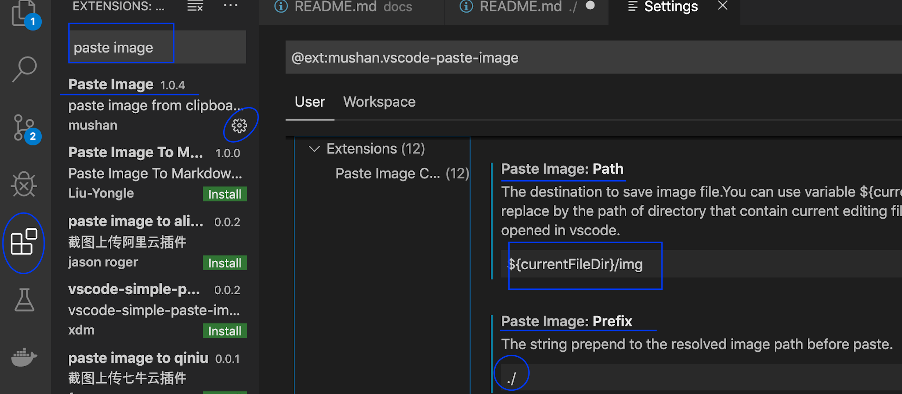
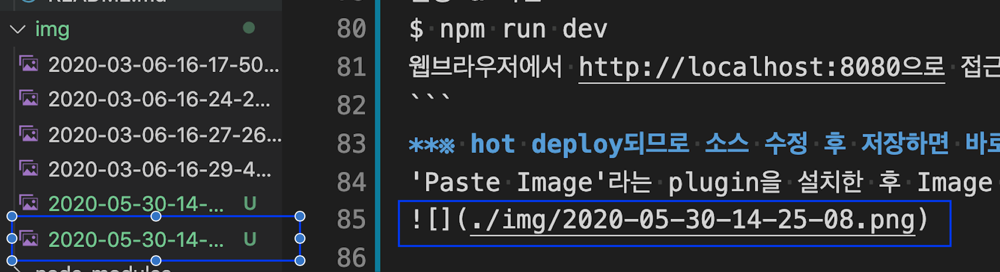

# kubepia.github.io
> 본 프로젝트는 kubernetes관련 정보공유 사이트인 [kubepia](http://kubepia.github.io)의 글 관리를 위해 운영됩니다.   

## kubepia 가입 신청
kubepia는 공개 커뮤니티이므로 누구나 가입하여 글을 올릴 수 있습니다.  
공개 커뮤니티이기 때문에 글을 올리실 목적이 아니라면 가입 없이도 자유롭게 글을 보실수 있습니다.  
가입 절차는 아래 내용으로 운영자에게 요청하시면 됩니다.  
> **가입요청 메일**  
```
  To: hklee@kr.ibm.com  
  요청내용(이름과 email만 필수)  
  - 이름:   
  - 회사:   
  - email:   
  - 가입목적:   
```

## How to write
node.js의 vuepress라는 모듈을 이용하여 글을 등록합니다.  
아래와 같은 순서로 글이 publishing됩니다.  
- git clone  
- 글 작성/수정  
- git merge & push  
- HTML생성  
  미리 작성된 git action이 자동 수행됨   
  - vuepress가 소스를 읽어 html들 생성  
  - 생성된 html들을 master branch로 overwrite  

---

### Step01 : Clone
1. clone this repository with branch 'dev'
   ```sh
   git clone -o origin https://github.com/kubepia/kubepia.github.io.git
   cd kubepia.github.io
   ```

---

### Step02 : Write/Modify
#### 본인 Local branch로 전환
   **반드시 Local에 본인만의 branch를 만들어 작업하십시오.**  
   여러 사람이 글을 관리하므로 충돌나지 않게 자기만의 날짜별 branch에서 작업하셔야 합니다.  
   ```sh
   git checkout -b 20200305
   이미 있다면 git checkout 20200305
   ```
#### How to add nav item
우측 상단에 있는 Main navigation 수정방법입니다.  
1. Open /docs/.vuepress/config.js
2. goto item
   
3. add name and link : { text: "DevOps", link: "/devops/overview" }
   1. text : display in nav menu
   2. link
      1. use directory default then '/[directory name]/'
      2. use page url : '/[directory]/[md filename without .md]/'

#### How to add sidebar item
Sub navigator 수정 방법입니다.  
1. Open /docs/.vuepress/config.js
2. goto item
   
3. add match url to nav bar : if devops is selected, then "/devops/"
4. add display name in title
5. children items : title & path in array under children
   

#### How to comment and reply block
각 글의 맨 하단에 댓글 영역 추가 방법입니다.  
1. add '<disqus/>' at the bottom of page
2. 운영자라면 log in disqus.com with kubepia2020@gmail.com

#### Local에서 preview  
수정 내용을 upload하기 전에 Local에서 미리 보기할 수 있습니다.  
```sh
$ cd <git root> 
예) cd ~/kubepia.github.io

최초 한번은 관련 모듈을 설치해야 합니다.  
$ npm install 

실행 & 확인  
$ npm run dev
웹브라우저에서 http://localhost:8080으로 접근합니다.  
```
**※ hot deploy되므로 소스 수정 후 저장하면 바로 반영됩니다.**  
즉, 위 preview는 중단하지 말고 그대로 실행시켜 놓으면 수정사항이 바로 바로  
반영되어 편리합니다.  

#### clipboard image바로 생성 및 붙여넣기  
작성 시 화면캡처한 이미지를 즉시 파일로 생성하고 소스에 image tag를 추가할 수 있습니다.  

'Paste Image'라는 plugin을 설치한 후 Image path와 문자열 prefix를 적절하게 셋팅하십시오.  


이제 클립보드에 이미즈를 복사한 후 소스의 붙여넣을 위치에서 CTRL+ALT+V(Mac은 Option+Command+V)를 클릭하면  
아래와 같이 이미지 문자열이 자동생성됩니다. 당연히 그 위치에 image파일이 생깁니다.  


---

### Step03 : Commit, Pulling, Merge and Push

#### Commit 
아래와 같이 본인 작성 소스를 병합하고 push합니다.  
``` sh
git add .
git commit -m "describe changes"
```
#### Pulling
**dev브랜치로 전환**  
```sh
$ git checkout dev
```
서버에서 변경사항 pulling  
```sh
$ git pull origin dev
```

#### Merge
```sh
$ git merge <local 작업 branch>
예) git merge 20200305
```

#### Push
```sh
$ git push origin dev
```

---

### Step04 : Confirm changes  

git action 수행 시간이 있으므로 약 5분 정도 후에  
[kubepia](https://kubepia.github.io/)에 접근하여 변경사항이 반영되었는지 확인합니다.  
   
