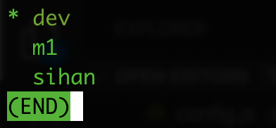

# kubepia.github.io
> 본 프로젝트는 kubernetes관련 정보공유 사이트인 [kubepia](http://kubepia.github.io)의 글 관리를 위해 관리됩니다.   

## kubepia 가입 신청
kubepia는 공개 커뮤니티이므로 누구나 가입하여 글을 올릴 수 있습니다.  
공개 커뮤니티이기 때문에 글을 올리실 목적이 아니라면 가입 없이도 자유롭게 글을 보실수 있습니다.  
가입 절차는 아래 내용으로 운영자에게 요청하시면 됩니다.  
> **가입요청 메일**  
  To: hklee@kr.ibm.com  
  요청내용(이름과 email만 필수)  
  * 이름:   
  * 회사:   
  * email:   
  * 가입목적:   

## How to write
node.js의 vuepress라는 모듈을 이용하여 글을 등록합니다.  
아래와 같은 순서로 글이 publishing됩니다.  
- git clone  
- 글 작성/수정  
- git merge & push  
- HTML생성 
  미리 작성된 git action이 자동 수행됨   
  - vuepress가 소스를 읽어 html들 생성  
  - 생성된 html들을 master branch로 overwrite  

### Step01 : Clone
1. clone this repository with branch 'dev'
   ```sh
   git clone -o origin https://github.com/kubepia/kubepia.github.io.git
   cd kubepia.github.io
   git branch
   ```
2. make sure branch is 'dev'.\
   

### Step02 : Write/Modify
1. checkout branch to modify or add document in local only
   ```sh
   git checkout -b 20200305
   ```
2. live view: npm run dev
3. create/modify document
4. test to build : npm run build
5. make sure no error in console output
6. commit
   ``` sh
   git add .
   git commit -m "describe changes"
   ```

### Step03 : Merge with others' changes
1. checkout 'dev' : git checkout dev
2. update from remote : git pull origin dev
3. merge local change to 'dev': git merge 20200305
4. push : git push origin dev

### Step04 : Confirm changes
---
## How to add nav item

1. Open /docs/.vuepress/config.js
2. goto item
   
3. add name and link : { text: "DevOps", link: "/devops/overview" }
   1. text : display in nav menu
   2. link
      1. use directory default then '/[directory name]/'
      2. use page url : '/[directory]/[md filename without .md]/'
   
## How to add sidebar item

1. Open /docs/.vuepress/config.js
2. goto item
   
3. add match url to nav bar : if devops is selected, then "/devops/"
4. add display name in title
5. children items : title & path in array under children
   

## How to comment and reply block

1. add '<disqus/>' at the bottom of page
2. log in disqus.com with kubepia2020@gmail.com