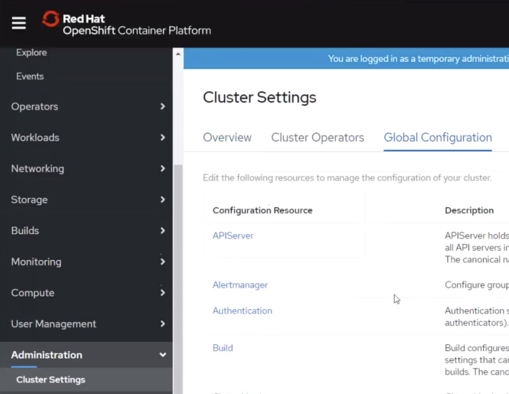

# CP4App-Common Service 설치

:::tip TASK DESCRIPTION
IBM Common Service를 설치합니다.  
Common Service는 IAM, Metering, Monitoring을 제공합니다.  
IBM Common Service설치 가이드는 아래와 같이 볼 수 있습니다.  
- [CP4App knowledge center](https://www.ibm.com/support/knowledgecenter/en/SSCSJL/welcome.html)접근  
- 설치할 버전 선택  
- Installing > Installing with the cloud pak CLI > Installing Common Services 클릭  
 

IBM Common Service IAM에 대한 설명, 설치, 구성에 대해서는 아래 동영상을 참조하십시오.  
[IBM Common Service IAM](https://drive.google.com/file/d/1seMcwdapR2tf9lJSkp-jsBGogG86elyw/view?usp=sharing)

[[toc]] 
:::

:::tip
설치 시 [screen: 가상터미널을 이용한 백그라운드 명령 실행](https://happycloud-lee.tistory.com/119)을 이용하여 보십시오.  
실수나 네트워크 단절로 Terminal이 끊어져도 안전하게 설치를 진행할 수 있습니다.   
:::

아래 작업은 Cluster api-server에 접근할 수 있는 Terminal 또는 bastion서버에서 수행합니다.   

## LDAP서버 설치 및 user/group추가
IBM Common Service의 IAM은 IdP(Identity Provider)로 LDAP만 지원합니다.  

- **아래 글을 참조하여 LDAP서버를 docker 또는 Pod로 설치합니다.**   

[LDAP서버 설치](https://happycloud-lee.tistory.com/117?category=832250)


- **LDAP user/group추가**  
  - **ou=users, ou=groups추가**  
  Generic: Organizational Unit 선택  
  
    
  users 또는 groups입력  
  
    
  [Commit]클릭  
  
  
  - **user추가**  
  ou=users선택 > Create a child entry 클릭  
  
  'Default'선택  
  
  'iNetOrgPerson'선택  
  
  RDN은 'Usern Name(uid)'선택. cn, sn, password, username입력  
  
  [Commit]클릭  
  
  
  다른 사용자 추가시에는 기존 user를 복사하여 생성하는게 편함  
  
  
  

  - **group추가**    
  ou=groups선택 > Create a child entry 클릭  
  
  'Default'선택  
   
  'groupOfUniqueNames'선택  
  
  RDN은 'cn(cn)'선택. cn, uniqueMember선택  
  
  [Commit]클릭  
  
  다른 그룹 추가시에는 user복사와 유사하게 'Copy or move this entry'를 클릭하여 기존 group을 복사하여 생성하면 됨  
  

### snapshot 작성  
Common Service 설치 전에 모든 VM들의 snapshot을 작성합니다. 
  
## IBM Common Service 설치
### 설치registry를 접근하기 위한 entitlement key취득 
- **Installing > Installing with the cloud pak CLI클릭**  

- **MyIBM Container Software library클릭**  
[MyIBM Container Software library](https://myibm.ibm.com/products-services/containerlibrary)

- **Login**  

- **Key값 복사**  


### 설치 configuration files 생성  
- **환경변수값 셋팅**  
```
<apikey>에는 위에서 복사한 key값을 입력하면 됨  
$ export ENTITLED_REGISTRY=cp.icr.io
$ export ENTITLED_REGISTRY_USER=cp
$ export ENTITLED_REGISTRY_KEY=<apikey>
```
- **registry login**  
bastion VM에 docker 설치를 먼저 하십시오.  
[centos7에 docker설치](https://happycloud-lee.tistory.com/14?category=830565) 

```
$ docker login "$ENTITLED_REGISTRY" -u "$ENTITLED_REGISTRY_USER" -p "$ENTITLED_REGISTRY_KEY"
```
- **container image을 pulling하고 라이센스 보기**  
'icpa-installer:4.1.1'는 설치 버전에 맞게 변경하십시오.  
```
$ docker run -e LICENSE=view \
           "$ENTITLED_REGISTRY/cp/icpa/icpa-installer:4.1.1"
```


- **설치 config파일들 생성**  
'icpa-installer:4.1.1'는 설치 버전에 맞게 변경하십시오.  
```
$ mkdir ~/data
$ docker run -v $PWD/data:/data:z -u 0 \
           -e LICENSE=accept \
           "$ENTITLED_REGISTRY/cp/icpa/icpa-installer:4.1.1" cp -r "data/*" /data
```


### 설치 config파일들 수정 

- **Installing > Installing with the cloud pak CLI > Installing Common Services 클릭**   


- **commonservice.yaml 수정**  
storageClass, dedicatedNodes, services를 수정합니다.  

```
SAMPLE

...
spec:
  ...
  storageClass: thin
  ...
  dedicatedNodes:
    - worker-1.hcis.kubepia.com 
    - worker-2.hcis.kubepia.com
    - worker-3.hcis.kubepia.com
  ...

```
  - storageClass: 'thin'으로 지정  
    Provisioner가 'kubernetes.io/no-provisioner'가 아니고 accessMode가 ReadWriteOnce인 Storage Class지정  
  - dedicatedNodes: common service가 설치될 Worker Node들 지정.  
    HA를 위해 1개 이상의 홀수로 지정하여야 함  
  - services: 설치할 service는 present로 변경.  

### installer 실행
- **cluster login**  
```
$ oc login https://<your_cluster_hostname> -u <username> -p <password>
```

:::tip
oc login이 아래 에러가 나면 ~/.kube/config파일을 삭제하고, 다시 로그인하시면 됩니다.  
error: x509: certificate signed by unknown authority
:::

- **installer 실행**  
'icpa-installer:4.1.1'는 설치 버전에 맞게 변경하십시오. 
반드시 install yaml파일들이 있는 data디렉토리의 상위 디렉토리에서 수행하세요.  
```
$ docker run -v ~/.kube:/root/.kube:z -u 0 -t \
          -v $PWD/data:/installer/data:z \
          -e LICENSE=accept \
          -e ENTITLED_REGISTRY -e ENTITLED_REGISTRY_USER -e ENTITLED_REGISTRY_KEY \
          "$ENTITLED_REGISTRY/cp/icpa/icpa-installer:4.1.1" cs-install
```

설치 진행상황은 Terminal console보다는 OCP Webconsole의 Event를 보시는게 더 좋습니다.  
계속 동일한 에러가 발생하면(예: PV binding 에러, pull image fail등) 중단하고 원인을 조치한 후  
재시도 하십시오. 


:::tip 설치 실패시 clear
설치 실패 시 처음부터 다시 설치하려면 uninstall을 먼저해야 합니다.  
위 명령어의 가장 마지막 'cs-install'을 'cs-uninstall'로 바꿔서 실행하면 됩니다.  
재시도 시 시작하자 마자 2단계정도에서 실패하면 위 docker login과 oc login을   
다시 한번 하고 설치하십시오.  

그 외 에러는 [Common service install Trouble shooting guide](https://www.ibm.com/support/knowledgecenter/SSCSJL_4.1.x/troubleshoot-cs.html)를 참조하세요. 
:::

### Common Service 로그인 

- **install 완료 확인**  
완료 메시지에서 common service url, default admin id, default admin password를 구합니다.  


```
default admin id : csadmin
$ oc -n ibmplatform-service get secret admin-credential -o jsonpath='{.data.defaultAdminUser}' | base64 --decode

default admin pw
$ oc -n ibmplatform-service get secret admin-credential -o jsonpath='{.data.defaultAdminPassword}' | base64 --decode
```

- **Common Service 로그인**  
위에서 구한 url로 접근하고, admin id/pw로 로그인합니다.  


## IBM Common Service 설정
- **LDAP Connection 추가**  

| 항목 | 설명 | 예 |
|:-----------------|:-----------------------|:--------------------|
| connection name | 적절하게 구별된 이름 부여 | seromi-ldap |
| Server type | LDAP 종류. openldap은 Custom선택 | Custom |
| Base DN | LDAP Hostname에 따라 구별된 이름 지정 | dc=ldap,dc=cp,dc=darumtech,dc=net |
| Bind DN | LDAP admin의 구별된 이름 지정 | cn=admin,dc=ldap,dc=cp,dc=darumtech,dc=net |
| Bind DN paessword | LDAP admin 암호 | 생략 |
| LDAP server | ldap://[서비스명(oc get svc -n ldap으로 구함)].[namespace].svc:389 |  ldap://ldap-openldap.ldap.svc:389 |
| Group filter | Group가져올때 query | (&(cn=%v)(objectclass=groupOfUniqueNames)) |
| User filter | User가져올때 query | (&(uid=%v)(objectclass=inetOrgPerson)) |


- **Team 추가**  
  - Teams탭을 클릭하고 [Create Team]클릭  
    

  - Member로 LDAP user/group지정  
    
    

- **Namespace 권한 부여**  
  - 권한을 부여할 Team을 클릭합니다.  
    

  - Resources탭을 클릭하고 [Manage resource]를 클릭합니다.  
    

  - 권한부여할 namespace들을 체크합니다.  
    


## OCP-OCP IdP로 등록
OCP의 IdP로 Common Service를 등록합니다.  
- **IdP등록 가이드 오픈**  
설치 가이드에서 '
Setting up IBM Common IAM as OpenShift OAuth Identity Provider'을 클릭합니다.  


- **Common IAM의 admin id/pw를 구합니다.**  
```
$ oc -n ibmplatform-service get secret admin-credential -o jsonpath='{.data.defaultAdminUser}' | base64 --decode

$ oc -n ibmplatform-service get secret admin-credential -o jsonpath='{.data.defaultAdminPassword}' | base64 --decode
```

- **Common Service dashboard URL을 구합니다.**  
```
$ oc -n kube-system get route icp-console -o=jsonpath={.spec.host}
```
- **Common Service CA(Certificate Authority) File생성**  
아래 명령으로 icp-console.pem파일을 생성합니다.  
```
$ oc -n kube-system get secret icp-management-ingress-tls-secret -o=jsonpath='{.data.tls\.crt}' | base64 --decode | tee -a icp-console.pem
```

- **Client 리소스 생성**  
**openclient.yaml생성**  
```
$ vi openclient.yaml 

apiVersion: oidc.security.ibm.com/v1
kind: Client
metadata:
  namespace: default
  name: ocpclient
spec:
  secret: ocpclientsecret
  oidcLibertyClient:
    post_logout_redirect_uris:
    - https://console-openshift-console.apps.example.com:443
    trusted_uri_prefixes:
    - https://console-openshift-console.apps.example.com:443
    redirect_uris:
    - https://oauth-openshift.apps.example.com/oauth2callback/IBM-IAM
```
**'oidcLibertyClient' 하위의 주소 3개를 변경합니다.**  


**Client 리소스 생성**  
$ oc apply -f openclient.yaml

**리소스 생성 확인**  
```
$ oc get Client ocpclient -n default
```

- **CLIENT_ID와 CLIENT_SECRET값을 구합니다.**  
```
$ oc -n default get secret ocpclientsecret -o jsonpath='{.data.CLIENT_ID}' | base64 --decode
$ oc -n default get secret ocpclientsecret -o jsonpath='{.data.CLIENT_SECRET}' | base64 --decode
```

- **OCP OAuth페이지 오픈**  
cluster-admin역할을 가진 사용자(예:kubeadmin)로 로그인합니다.  
Administration > Cluster Settings을 선택 후 Global Configuration탭을 누릅니다.  


OAuth를 찾아 클릭합니다.   


- **IdP추가**  
  - Identity Providers에서 [Add]클릭하고, OpenID Connect를 선택합니다.  
    
  - Name, Client ID, Client Secret, Issuer URL을 입력합니다.  
    **Name은 반드시 'IBM-IAM'으로 해야 합니다.**  
    **Issuer URL은 [Common Services dashboard URL]/oidc/endpoint/OP입니다.**  
    
  - CA File, Extra Scopes를 입력합니다.  
    **Extra Scopes의 값은 반드시 'profile'로 해야 합니다.**  
    

- **Common Service로 로그인**  
Logout을 하면 로그인페이지에 IBM-IAM이라는 버튼이 표시됩니다.   


IBM-IAM을 클릭하면 Common Service Login페이지가 표시됩니다.  


로그인이 정상적으로 되면 OCP 초기화면이 표시됩니다.  


## Logout 버그 Fix
IBM Common Service로 로그인을 하면 Logout이 안되는 버그가 있습니다.  
[IBM CommonService IAM 로그아웃 안되는 현상 해결](https://happycloud-lee.tistory.com/118)문서를 참조하여 처리하십시오.  

---
**중요: User Identities 초기화**  
:::tip 
각 사용자는 인증 IdP에 따라 Identities값이 셋팅됩니다.  
IdP가 변경된다면(예: htpasswd => Common Service IAM) Identities값을 초기화해줘야 합니다.  
예를 들어 user1이 htpasswd로 등록되었다가 Common Service의 LDAP에 등록된 경우  
만약 user1이 htpasswd로 로그인했다면 Identities는 'htpasswd-user1'이 됩니다.  
user1을 LDAP에 등록 후 Common Service로 로그인하려고 하면  
'사용자를 생성할 수 없다'라는 에러가 납니다.  

**Identities값 초기화는 YAML을 편집하여 identities의 값을 'null'로 변경하면 됩니다.**  


::: 

---
<disqus/>
