# OCP-CP4App 설치

:::tip TASK DESCRIPTION
CP4App 컴포넌트를 설치합니다.  
컴포넌트에는 Accelerators for Teams(=kabanero), Application Navigator, Transformation Advisor, Mobile Foundation이 있습니다.  

[[toc]] 
:::

:::tip
설치 시 [screen: 가상터미널을 이용한 백그라운드 명령 실행](https://happycloud-lee.tistory.com/119)을 이용하여 보십시오.  
실수나 네트워크 단절로 Terminal이 끊어져도 안전하게 설치를 진행할 수 있습니다.   
:::

## config.yaml 수정 
- **설치 디렉토리로 이동**  
[IBM Common Service설치 > 설치 Configuration파일 생성](https://kubepia.github.io/cloudpak/cp4app/install/cp4app01.html#%EC%84%A4%EC%B9%98-configuration-files-%EC%83%9D%EC%84%B1)시 생성했던 설치 디렉토리로 이동합니다.  
그리고 config.yaml파일을 오픈합니다.  

- **TA config값 제거**  
config항목에 있는 yaml파일명을 빈 문자열로 변경합니다.  

| 현재 | 변경 |
|:------------|:-----------|
|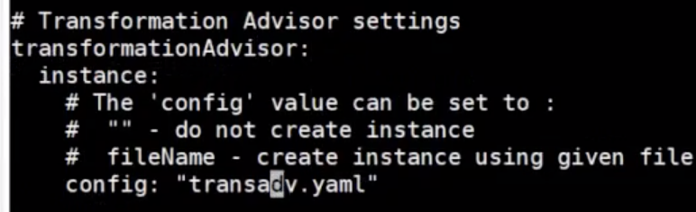 | 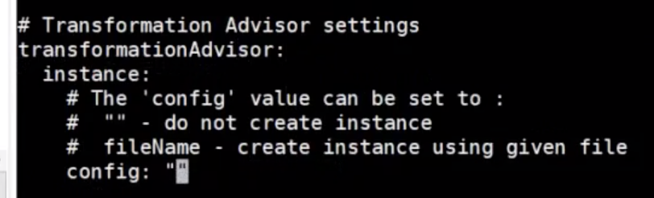 |

- **A4T(Accelerators for Teams)정보 입력**  
  - github에 Organization 생성  
    appsody stack이 저장될 github organization을 만듭니다.

    | Task | 내용 |
    |:-------------|:--------------|
    | New Organization클릭 | 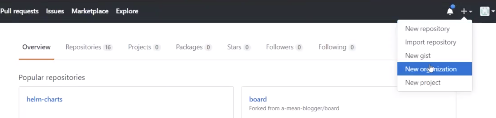 |
    | Organization 정보 입력 | 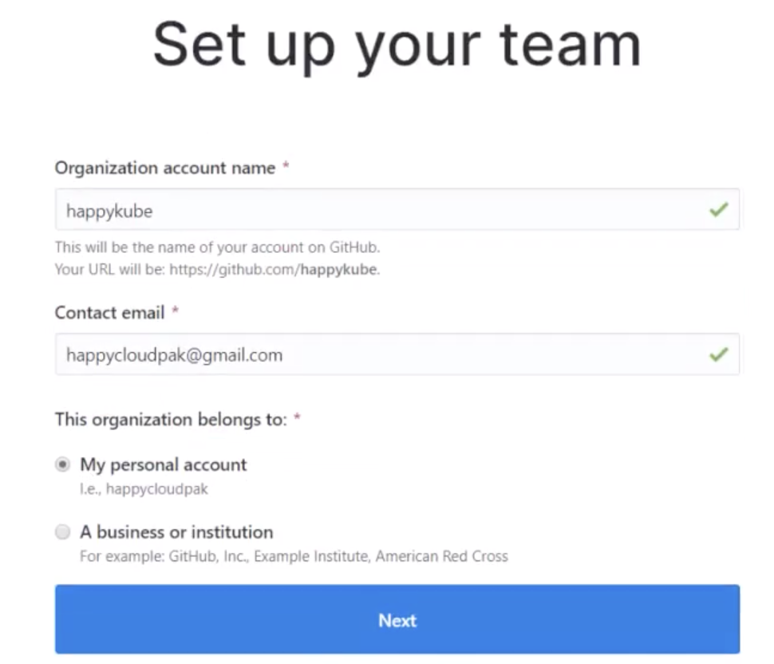 | 
    | Organization 초기화면 | 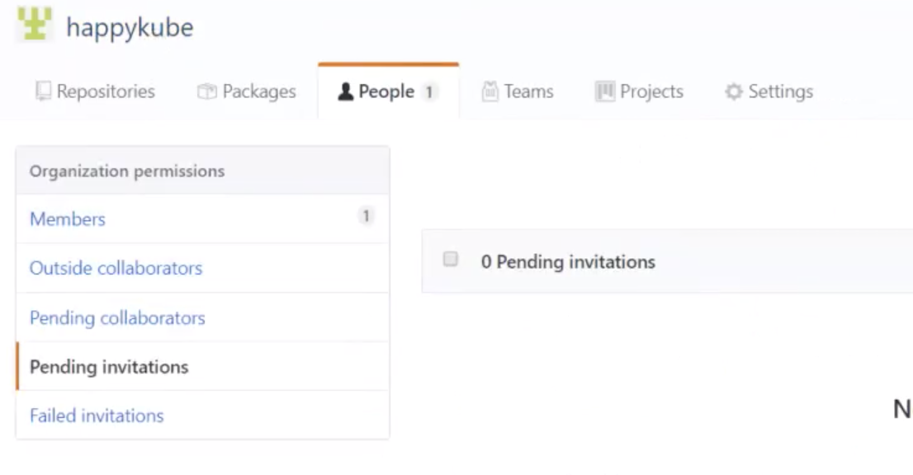 |
    
  - Organization 하위에 Team 생성  
    appsody stack이 저장될 organization하위의 Team을 만듭니다.   
    
    | Task | 내용 |
    |:-------------|:--------------|
    | Teams탭 선택 후 [New Team]클릭 | 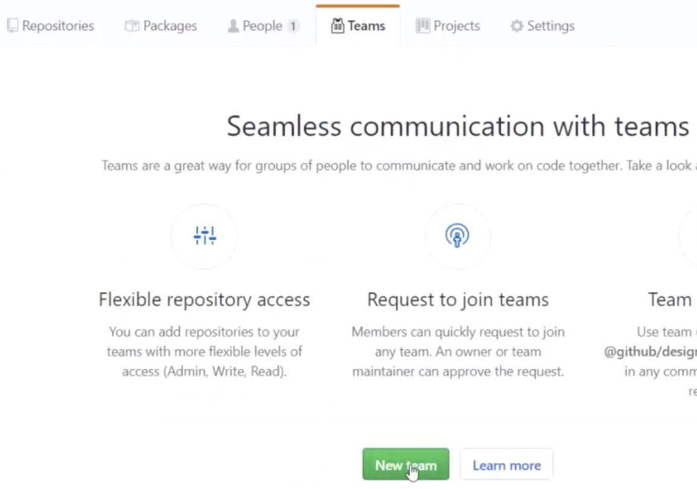 | 
    | Team 정보 입력 | 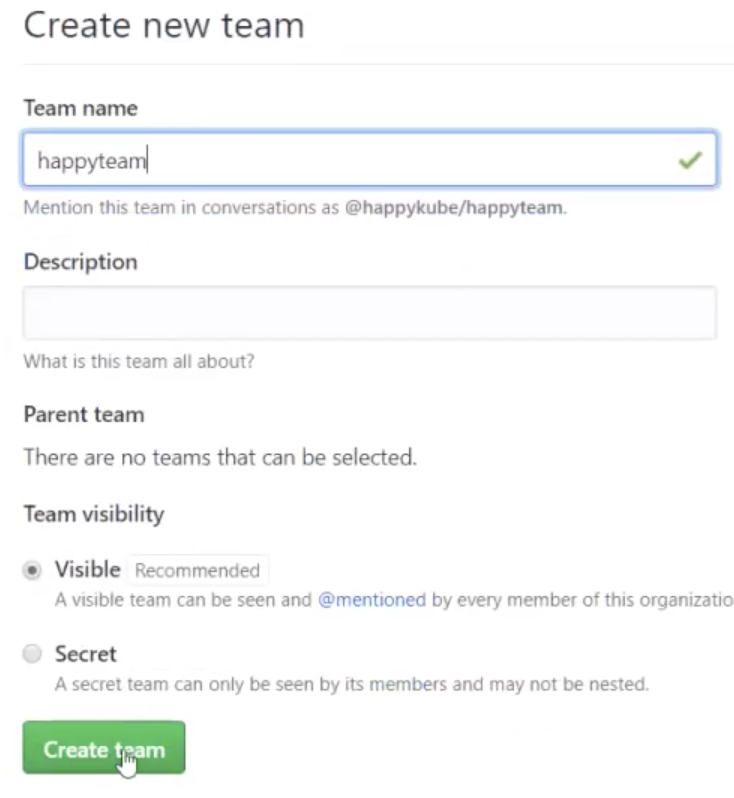 |
    
  - github access token 생성 
    | Task | 내용 |
    |:-------------|:--------------|
    | Settings 클릭 | 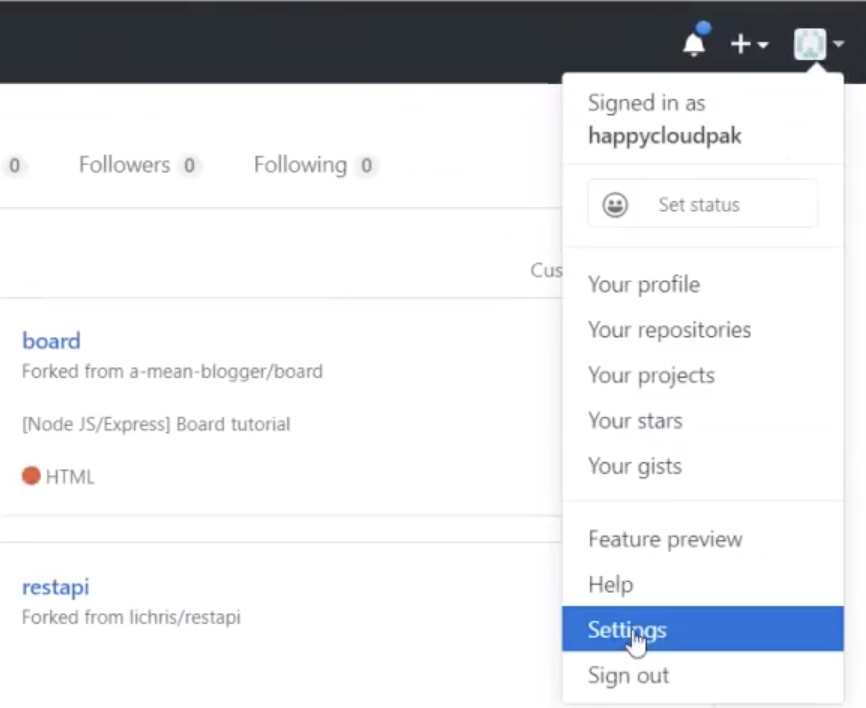 |
    | 좌측 맨 하단의 Developer settings클릭 | 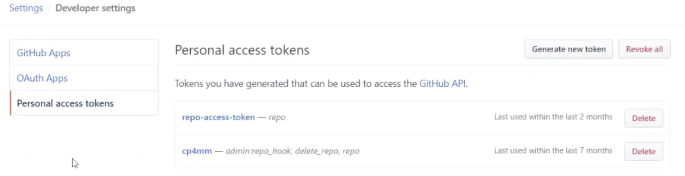 |
    | [Generate Token]클릭->이름, repo체크 | 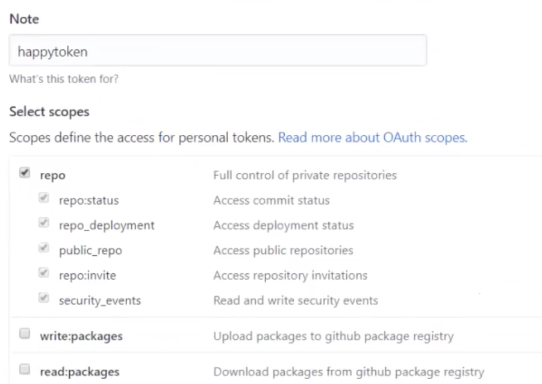 | 
    | Access Token 복사 | 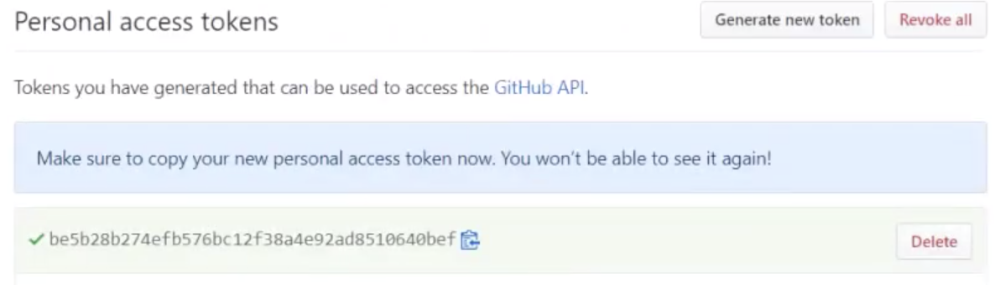 |
        
  - config.yaml의 teams항목에 위에서 생성한 값을 입력합니다.  
    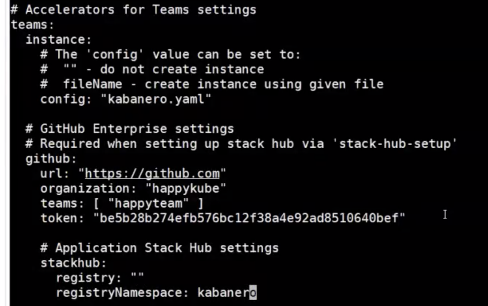

## OCP pull secret추가
이 단계는 설치 가이드에는 없습니다.  
하지만 이 단계를 생략하면 아래와 같이 image pulling에러가 발생합니다.  
원인은 CP4App의 Pod에서 'gcr.io'라는 registry의 image를 pulling할 수 있는 인증token이 없기 때문입니다.  

Workaround로 아래와 같이 OCP의 Secret 'pull-secret'에 인증 token을 추가하십시오.  
- [Common Service 설치 configuration files 생성](https://kubepia.github.io/cloudpak/cp4app/install/cp4app01.html#ibm-common-service-%EC%84%A4%EC%B9%98)단계에서 셋팅한   ENTITLED_REGISTRY, ENTITLED_REGISTRY_USER, ENTITLED_REGISTRY_KEY값을 구합니다.  
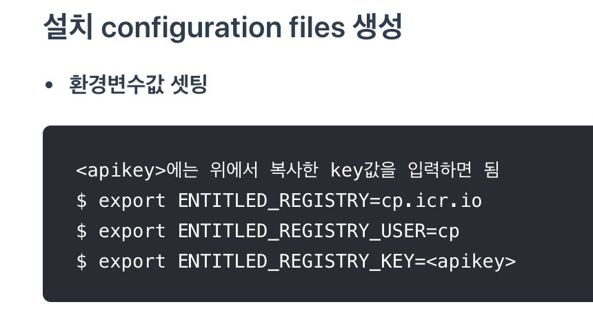

- **Workloads > Secrets 클릭하고, Project는 openshift-config선택 후 pull-secret찾기**  
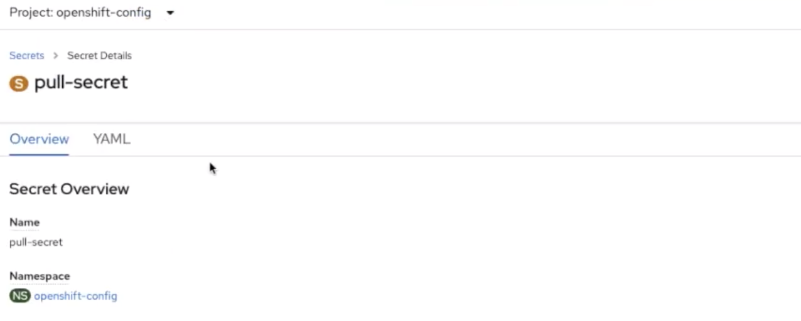
- **'cp.icr.io'에 대한 인증token값을 추가**  
 - Action > Edit Secret
   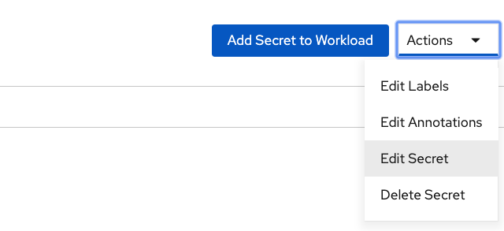
 - Secret값 추가  
   - Registry server Address: ENTITLED_REGISTRY  
   - Username: ENTITLED_REGISTRY_USER  
   - Password: ENTITLED_REGISTRY_KEY
   - Email: 아무 email이나 입력   
   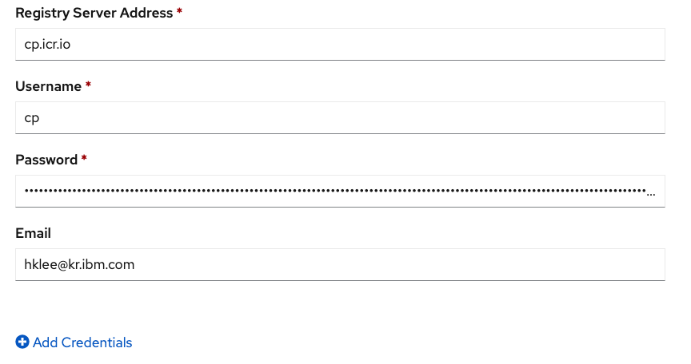
 - Secret값 확인
   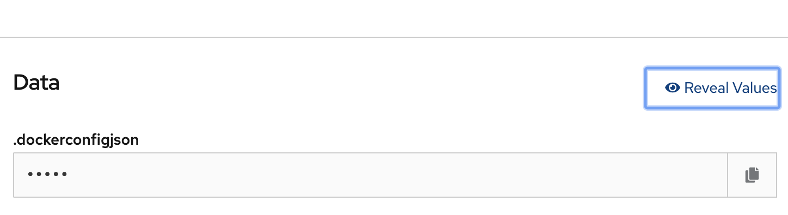
   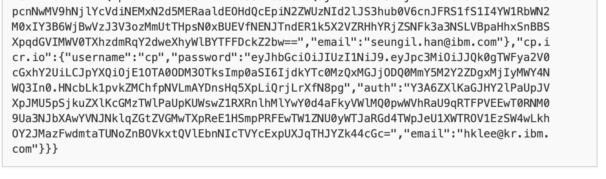

## Installer 실행 
- **cluster 로그인**  
```
$ oc login https://<your_api_cluster_url> -u <username> -p <password>
예) oc login https://api.hcis.kubepia.com -u kubeadmin -p ********** 
```
- **설치준비 체크**  
'icpa-installer:4.1.1'은 설치 버전에 맞게 수정하십시오.  
```
$ docker run -v ~/.kube:/root/.kube:z -u 0 -t \
           -v $PWD/data:/installer/data:z \
           -e LICENSE=accept \
           -e ENTITLED_REGISTRY -e ENTITLED_REGISTRY_USER -e ENTITLED_REGISTRY_KEY \
           "$ENTITLED_REGISTRY/cp/icpa/icpa-installer:4.1.1" check
```
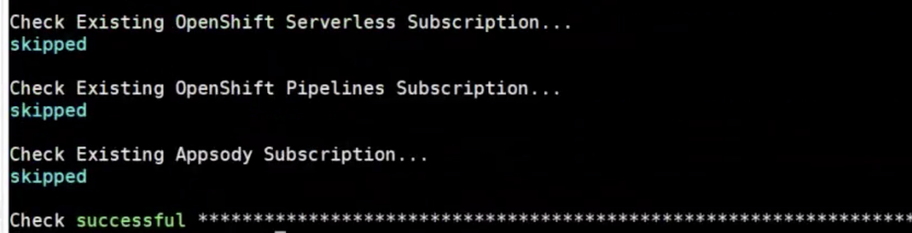

- **설치 시작** 
'icpa-installer:4.1.1'은 설치 버전에 맞게 수정하십시오.   
```
$ docker run -v ~/.kube:/root/.kube:z -u 0 -t \
           -v $PWD/data:/installer/data:z \
           -e LICENSE=accept \
           -e ENTITLED_REGISTRY -e ENTITLED_REGISTRY_USER -e ENTITLED_REGISTRY_KEY \
           "$ENTITLED_REGISTRY/cp/icpa/icpa-installer:4.1.1" install
```
> **참고**  
  설치 시 아래와 같이 Fail이 날 수 있습니다.  
  장시간 소요되는 step인 경우 발생할 수 있습니다.  
  이 경우 위 install 명령을 다시 실행하십시오.  
  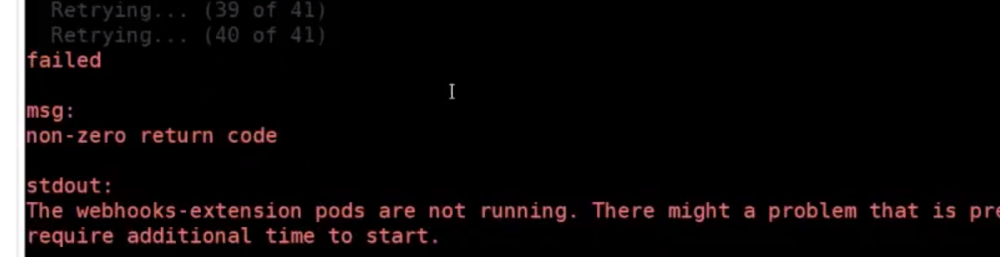

- **설치 완료 확인**  

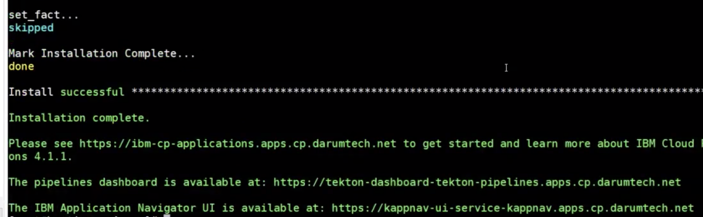

## CP4App Web Console 접근 
- **OCP Web console로그인 후 'Cloud Pak Console'메뉴 클릭**  
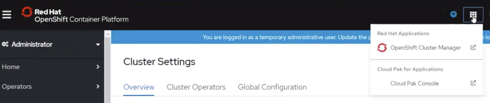

- **CP4App 초기화면**  
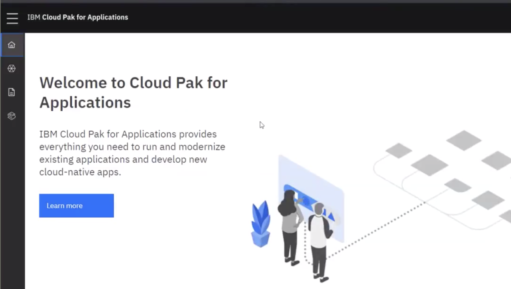

- **CP4App 메뉴화면**  
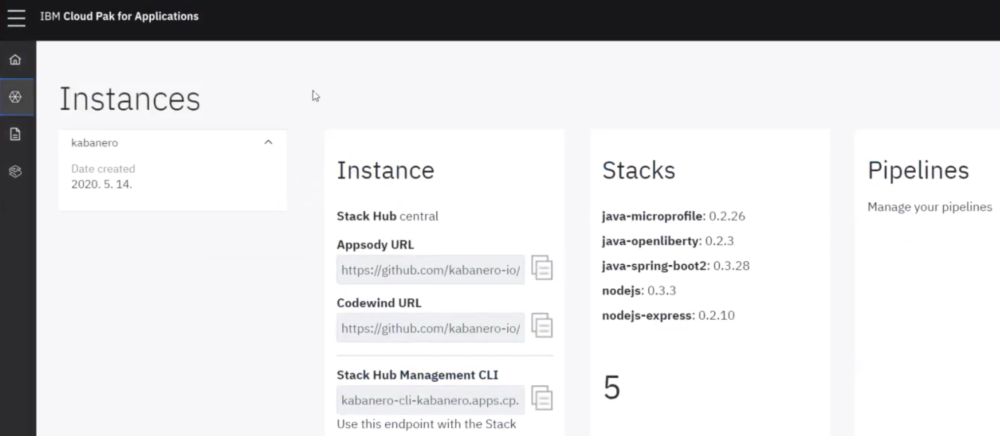

## TIP: ConsoleLink 추가하기 
[OCP ConsoleLink(ApplicationMenu) 추가](https://happycloud-lee.tistory.com/120)을 참조하여 자주 사용하는 메뉴를 추가하시기 바랍니다.  


---
<disqus/>
