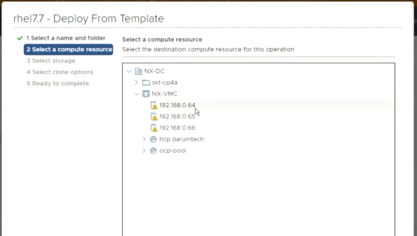

# Infra Servers-VM 생성
:::tip TASK DESCRIPTION
내외부연결(bastion), 네트워크, 스토리지, NAT서버 설치를 위한 VM을 생성합니다.
[[toc]] 
:::

## VM 템플릿 작성
VM을 생성하기 위한 RHEL7 VM템플릿을 먼저 작성합니다.    

[Create a RHEL 7 VM template for VMware vSphere](https://happycloud-lee.tistory.com/121)

## DRS자동화 설정
Distributed Resource Scheduler는 자동으로 가상머신을 ESXi Host에 분산 배치시켜 주는 기술입니다.   
VM생성을 쉽게 하기 위하여 이 기능을 enable시킵니다.   
DRS가 enable되면 VM생성 시 IP를 지정할 필요가 없습니다.   
가장 적합한 Host에 배치되면서 IP가 할당 됩니다.     


## VM 생성
Infra node 구성을 위한 VM은 bastion, network, storage, gateway(=iptables)입니다. 


또한 위 그림과 같이 각 VM node에는 아래와 같은 S/W가 설치됩니다.
| VM       | 설치 S/W                     |
|:-------- |:----------------------------|
| bastion  | Web 서버 |
| network  | dns, dhcp, haproxy |
| storage  | nfs |
| gateway  | iptables |

4개의 VM node를 아래와 같이 생성합니다.   
- **VMWare vCenter 로그인**

- **VM Template 선택 및 새 VM생성 시작**


- **VM name입력 및 위치 지정**


- **IP지정**  
DRS(Distributed Resource Schedule)가 enable되어 있으므로 아무IP나 선택합니다. 


- **Storage지정**  
미리 구성한 vCenter의 Storage를 선택합니다.
 

- **옵션지정**  
VM template에 이미 적절한 옵션이 지정되어 있으므로 skip해도 됩니다.  
CPU/Mem 조정이 필요하면 'Customize this virtual machine's hardware'를 체크하고 조정하십시오. 


- **최종 검토 및 생성**  
최종으로 지정한 내용을 검토하고 이상 없으면 [FINISH]버튼을 클릭하십시오.  


- **VM시작 & Web console 접근**  
하단 진행bar에서 VM생성이 완료된것을 확인하고, VM을 시작합니다.  
시작 후에 'Launch Web Console'을 클릭합니다.  


- **Public IP지정**  
DRS에 의해 IP가 자동 지정되었겠지만 미리 정한 IP로 변경합니다. 
VM Template에 정의된 root 암호로 로그인 한 후, 아래를 수행합니다.   
```
$ cd /etc/sysconfig/network-scripts
$ vi ifcfg-ens192
```


IPADDR값을 변경합니다.  


network서비스를 재시작하여 변경IP를 반영합니다.  
```
$ systemctl restart network
```


- **Terminal에서 VM접근**  


- **hostname 변경**  
```
$ hostnamectl set-hostname bastion
```
 

- **network, storage, gateway VM 생성**  
bastion VM생성 순서를 참조하여 VM들을 생성합니다.   
 
 
 

- **redhat subscription 등록**  
이 작업은 OS로 RHEL을 사용하는 경우에만 필요합니다.  
즉, centos를 사용하는 경우는 불필요합니다.  
yum install을 위해서는 redhat subscription을 먼저 등록해야 합니다.  
각 VM node에서 미리 등록하여 주십시오.  
redhat subscription등록 방법은 가이드메일을 참조하세요.  
```
전체 subscription 추가  
$ subscription-manager register --username [username] --password [password] --auto-attach

subscription별 추가: list에서 Pool ID확인하여 추가함    
$ subscription-manager register --username [username] --password [password]
$ subscription-manager list --available
$ subscription-manager attach --pool=<POOL ID>

참고: subscription refresh  
$ subscription-manager refresh
```


- **방화벽 중지**  
필요한 포트 오픈을 해줘야 하는데 테스트 환경이라면 방화벽을 내려서 모든 포트를 허용합니다.  
실제 운영환경에서는 방화벽에서 포트 오픈을 해줘야 합니다.  
각 VM에서 아래 명령으로 방화벽을 중지합니다.  

```
$ systemctl stop firewalld
$ systemctl disable firewalld 
```

---
<disqus/>
