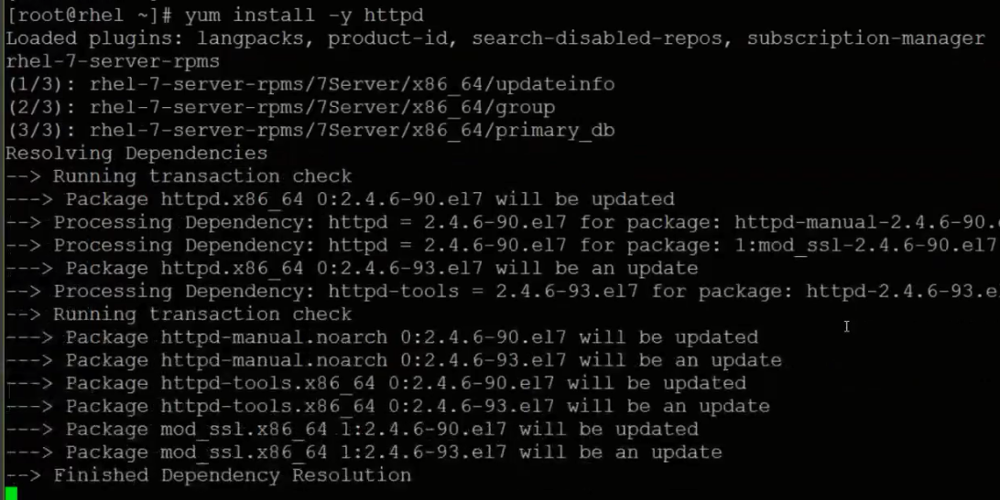

# Infra Servers-Web서버 설치
:::tip TASK DESCRIPTION
설치파일을 업로드/다운로드할 Web서버를 설치합니다.
[[toc]] 
:::

- **apache web server설치**  
bastion VM에서 수행합니다. 
```
$ yum install -y httpd
```


- **시작프로그램으로 등록**  
VM시작 시 자동으로 시작되도록 등록합니다.  
```
$ systemctl enable httpd
```

- **apache web server설정**  
기본 설정을 그대로 사용해도 됩니다.  
설정을 바꾸시려면 /etc/httpd/conf/httpd.conf파일을 변경하십시오.    

- **apache web server 시작**  
```
$ systemctl start httpd
```

- **html root디렉토리 테스트**  
html root디렉토리는 /var/www/html입니다.  
이 디렉토리에 파일을 하나 만들고 제대로 접근되는지 테스트합니다.  
```
$ cd /var/www/html
$ echo "hello httpd" > README.md
$ curl http://192.168.0.190/README.md
```

---
<disqus/>


