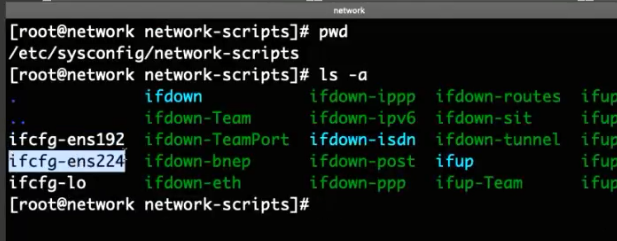
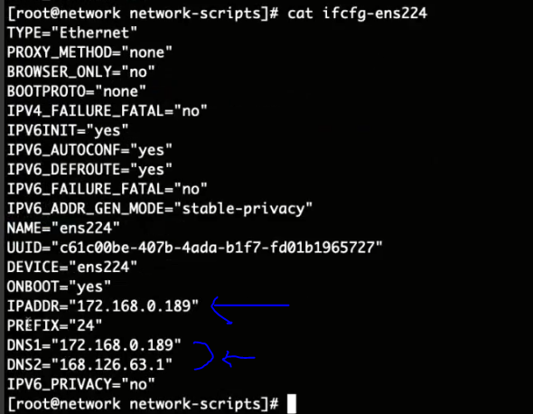
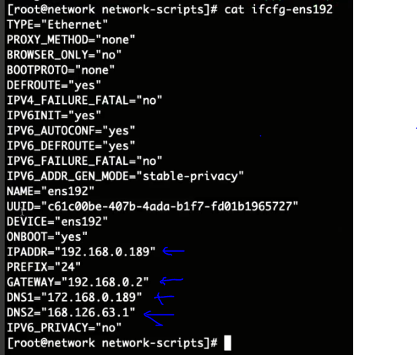

# Infra Servers-VM Network 설정

:::tip TASK DESCRIPTION
Infra VM의 네트워크를 설정합니다.
[[toc]] 
:::

각 VM의 Private IP(172.168.0.*)를 지정합니다.   
아래 작업을 각 VM에서 수행하십시오.  

## Private Network adapter 추가
- **Edit Setting클릭**  


- **Network adapter추가**  


## Private IP 셋팅
- **private ip용 설정파일 생성**  
추가한 network adpater를 위한 설정파일을 생성합니다.  
파일명은 ifcfg-ens224로 만드셔야 합니다.    
```
$ cd /etc/sysconfig/network-scripts
$ cp ifcfg-ens192 ifcfg-ens224
```


- **private IP셋팅**  
ifcfg-ens224파일에 private IP를 셋팅합니다.  
※ **GATEWAY설정은 반드시 삭제**해야 합니다. 
```
$ vi ifcfg-ens224
```


- **DNS서버 셋팅**  
ifcfg-ens192와 ifcfg-ens224파일에 DNS서버를 추가합니다.   
DNS서버는 network VM에 설치할 예정이므로, network VM의 private IP를 지정합니다.  
2차 DNS는 public DNS를 지정합니다. 


 
- **network 서비스 재시작**  
```
$ systemctl restart network
```

---
<disqus/>


