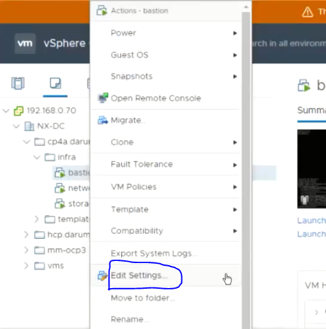
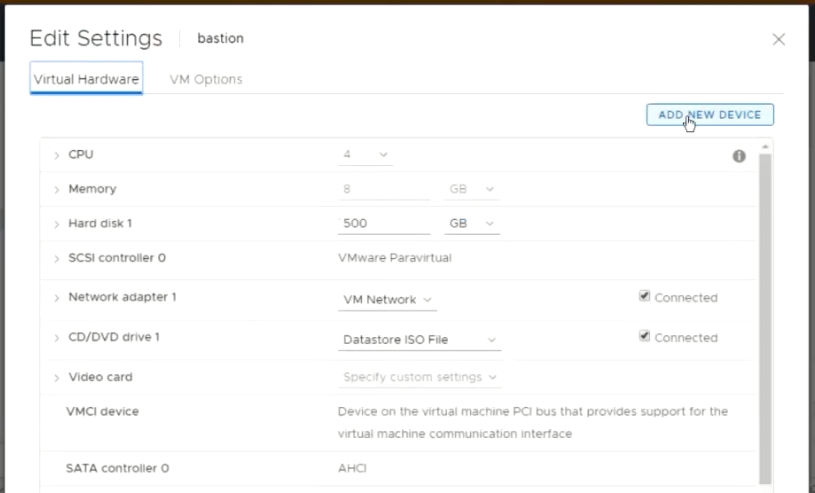
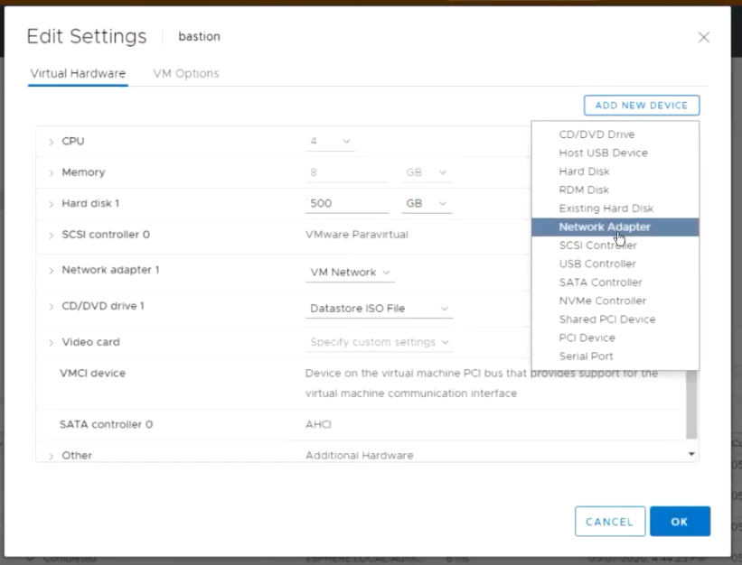
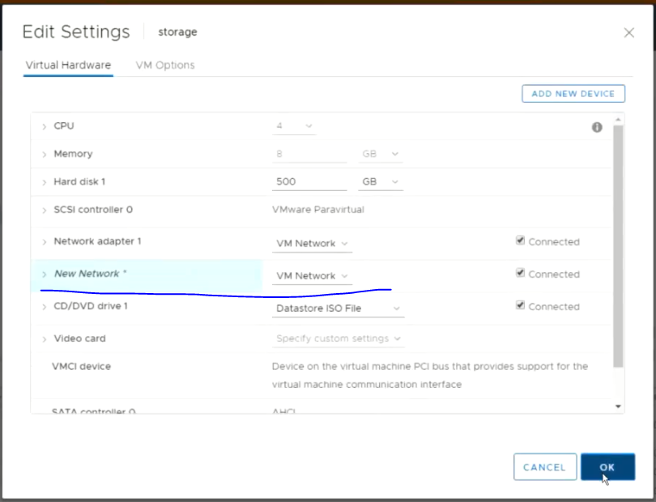
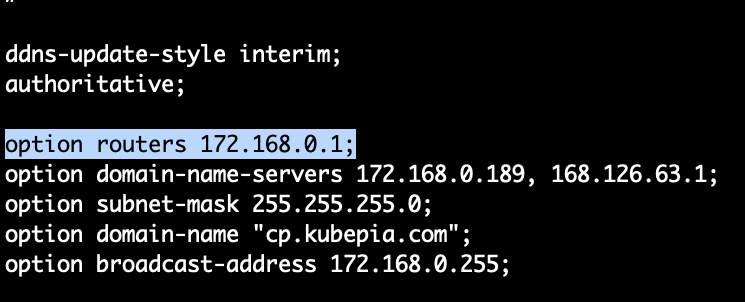

# Infra Servers-VM Network 설정

:::tip TASK DESCRIPTION
Infra VM의 네트워크를 설정합니다.
[[toc]] 
:::

각 VM의 Private IP(172.168.0.*)를 지정합니다.   
아래 작업을 각 VM에서 수행하십시오.  

## Private Network adapter 추가
- **Edit Setting클릭**  


- **Network adapter추가**  




## Private IP 셋팅
- **private ip용 설정파일 생성**  
추가한 network adpater를 위한 설정파일을 생성합니다.  
파일명은 ifcfg-ens224로 만드셔야 합니다.    
```
$ cd /etc/sysconfig/network-scripts
$ cp ifcfg-ens192 ifcfg-ens224
```

- **private IP셋팅**  
ifcfg-ens224파일에 private IP를 셋팅합니다.  
※ **GATEWAY설정은 반드시 삭제**해야 합니다. 
```
$ vi ifcfg-ens224

가이드 :
- NAME, DEVICE, IPADDR를 변경
- DNS1은 앞으로 추가할 DNS 서버 IP로 지정
- 기존 DNS1은 DNS2로 변제. DNS2는 public DNS로 셋팅. 8.8.8.8은 google public DNS임.
- 반드시 GATEWAY는 삭제  

TYPE=Ethernet
PROXY_METHOD=none
BROWSER_ONLY=no
BOOTPROTO=none
DEFROUTE=yes
IPV4_FAILURE_FATAL=no
IPV6INIT=yes
IPV6_AUTOCONF=yes
IPV6_DEFROUTE=yes
IPV6_FAILURE_FATAL=no
IPV6_ADDR_GEN_MODE=stable-privacy
NAME=ens224
UUID=a58ea52a-b041-4474-892a-ad40df598c57
DEVICE=ens224
ONBOOT=yes
IPADDR=172.168.0.190
PREFIX=24
DNS1=172.168.0.189
DNS2=8.8.8.8
IPV6_PRIVACY=no
```

:::tip 중요
**gateway VM의 private ip는 반드시 맨 끝을 1로 해주세요.**  
예) 172.168.0.1
dhcp설정(/etc/dhcp/dhcpd.conf)의 router주소와 동일해야 합니다.  

:::

- **DNS서버 셋팅**  
ifcfg-ens192에 DNS서버를 추가합니다.   
DNS서버는 network VM에 설치할 예정이므로, network VM의 private IP를 지정합니다.  
2차 DNS는 public DNS를 지정합니다. 

```
SAMPLE 
----------

TYPE=Ethernet
PROXY_METHOD=none
BROWSER_ONLY=no
BOOTPROTO=none
DEFROUTE=yes
IPV4_FAILURE_FATAL=no
IPV6INIT=yes
IPV6_AUTOCONF=yes
IPV6_DEFROUTE=yes
IPV6_FAILURE_FATAL=no
IPV6_ADDR_GEN_MODE=stable-privacy
NAME=ens192
UUID=a58ea52a-b041-4474-892a-ad40df598c57
DEVICE=ens192
ONBOOT=yes
IPADDR=192.168.0.190
PREFIX=24
GATEWAY=192.168.0.2
DNS1=172.168.0.189
DNS2=8.8.8.8
IPV6_PRIVACY=no
```

- **network 서비스 재시작**  
```
$ systemctl restart network
```

---
<disqus/>


