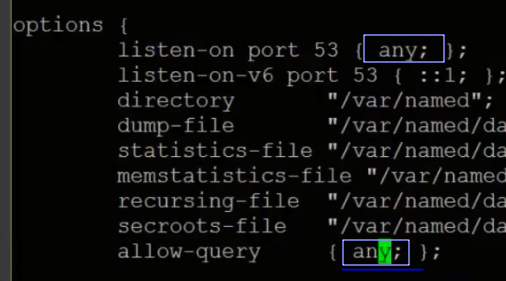
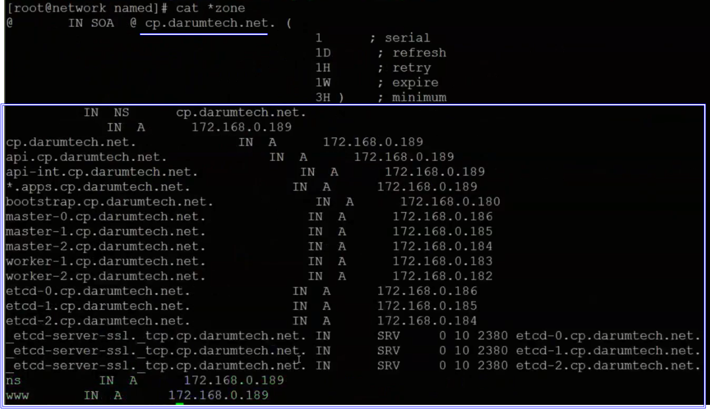

# Infra Servers-DNS서버 설치

:::tip TASK DESCRIPTION
Network VM에 DNS서버를 설치합니다. 
[[toc]] 
:::

## DNS서버 설치
Terminal 또는 ssh명령으로 Network VM을 접근합니다. 

```
$ yum install -y bind-utils bind
```


## named.conf의 DNS옵션 수정
```
$ cd /etc
$ vi named.conf 
```
아래와 같이 option을 수정합니다.  


## named.rfc1912.zones파일에 DNS설정파일 정의
named.rfc1912.zones파일은 named.conf파일에서 include문으로 선언된 파일입니다.  
DNS의 제반 설정 파일 위치를 지정합니다. 
```
$ cd /etc
$ vi named.rfc1912.zones
```
아래 예와 같이 Forward DNS와 Reverse DNS 설정파일을 지정합니다.  
- Forard DNS: name to IP resolving(분석)
- Reverse DNS: IP to name resolving. 이름은 <IP대역대 역방향>.in-addr.arpa(예:0.168.172.in-addr.arpa)입니다.  


## Foward DNS 설정
Forward DNS설정파일을 작성합니다. DNS설정파일은 /var/named에 생성합니다.  
```
$ cd /var/named
$ vi <Forard DNS 설정파일>
```
아래 표와 같이 각 목적별 주소의 IP를 지정해야 합니다.  
| 목적 | 예 |
|:--------------------|:-------------------------------------|
| base domain | cp.darumetch.net |
| api server | api.cp.darumtech.net |
| api server 연결 | api-int.cp.darumetech.net |
| applications 주소 | *.apps.cp.darumtech.net |
| 설치용 임시서버 | bootstrap.cp.darumetech.net |
| master nodes | master-*.cp.darumetch.net |
| worker nodes | worker-*.cp.darumetch.net |
| etcd servers | etcd-*.cp.darumetch.net |
| etcd간 통신 주소 | _etcd-server-ssl._tcp.cp.darumtech.net |
| DNS서버 주소 | ns |
| Web서버 주소 | www |




## Reverse DNS 설정
Reverse DNS설정파일을 작성합니다. DNS설정파일은 /var/named에 생성합니다.  
```
$ cd /var/named
$ vi <Reverse DNS 설정파일>
```
아래 표와 같이 각 마지막 IP값에 대한 주소를 지정해야 합니다.  
참고로 앞 3개 IP(예:172.168.0)는 named.rfc1912.zones파일에서 지정하였습니다.   
| 목적 | 예 |
|:--------------------|:-------------------------------------|
| base domain | 189 |
| api server | 189 |
| api server 연결 | 189 |
| 설치용 임시서버 | 180 |
| master nodes | 186, 185, 184 |
| worker nodes | 183, 182 |


## DNS서버 시작
```
DNS서버를 부팅시 자동 시작하도록 등록
$ systemctl enable named

DNS서버 시작
$ systemctl start named

상태확인
$ systemctl status named
```


## DNS설정 검증
bastion, network, storage, gateway VM에서 VM설정을 확인합니다. 
```
$ nslookup
```
- nslookup명령 실행 후 server명령으로 DNS서버 설정 확인   
- IP로 name resolving 테스트  
- name으로 IP resolving 테스트  


모든 설정 주소에 대해 확인합니다.  


---
<disqus/>


