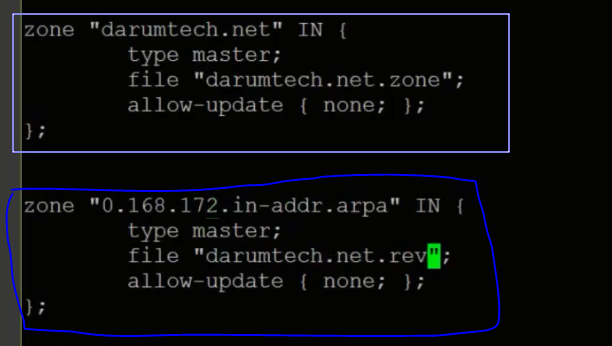

# Infra Servers-DNS서버 설치

:::tip TASK DESCRIPTION
Network VM에 DNS서버를 설치합니다. 
[[toc]] 
:::

## DNS서버 설치
Terminal 또는 ssh명령으로 Network VM을 접근합니다. 

```
$ yum install -y bind-utils bind
```


## named.conf의 DNS옵션 수정
```
$ cd /etc
$ vi named.conf 
```
아래와 같이 option을 수정합니다.  


## named.rfc1912.zones파일에 DNS설정파일 정의
named.rfc1912.zones파일은 named.conf파일에서 include문으로 선언된 파일입니다.  
DNS의 제반 설정 파일 위치를 지정합니다. 
```
$ cd /etc
$ vi named.rfc1912.zones
```
아래 예와 같이 Forward DNS와 Reverse DNS 설정파일을 지정합니다.  
- Forard DNS: name to IP resolving(분석)
- Reverse DNS: IP to name resolving. 이름은 <IP대역대 역방향>.in-addr.arpa(예:0.168.172.in-addr.arpa)입니다.  




## Foward DNS 설정
Forward DNS설정파일을 작성합니다. DNS설정파일은 /var/named에 생성합니다.  
```
$ cd /var/named
$ vi <Forard DNS 설정파일>
```
아래 표와 같이 각 목적별 주소의 IP를 지정해야 합니다.  
| 목적 | 예 |
|:--------------------|:-------------------------------------|
| base domain | cp.darumetch.net |
| api server | api.cp.darumtech.net |
| api server 연결 | api-int.cp.darumetech.net |
| applications 주소 | *.apps.cp.darumtech.net |
| 설치용 임시서버 | bootstrap.cp.darumetech.net |
| master nodes | master-*.cp.darumetch.net |
| worker nodes | worker-*.cp.darumetch.net |
| etcd servers | etcd-*.cp.darumetch.net |
| etcd간 통신 주소 | _etcd-server-ssl._tcp.cp.darumtech.net |
| DNS서버 주소 | ns |
| Web서버 주소 | www |

```
SAMPLE 

@ IN SOA @ cp.kubepia.com. (
                                                         3 ; serial
                                                         1D ; refresh
                                                         1H ; retry
                                                         1W ; expire
                                                         3H ) ; minimum
        IN NS cp.kubepia.com.
        IN A 172.168.0.189
cp.kubepia.com. IN A 172.168.0.189
api.cp.kubepia.com. IN A 172.168.0.189
api-int.cp.kubepia.com. IN A 172.168.0.189
*.apps.cp.kubepia.com. IN A 172.168.0.189
bootstrap.cp.kubepia.com. IN A 172.168.0.180
master-0.cp.kubepia.com. IN A 172.168.0.186
master-1.cp.kubepia.com. IN A 172.168.0.185
master-2.cp.kubepia.com. IN A 172.168.0.184
worker-1.cp.kubepia.com. IN A 172.168.0.183
worker-2.cp.kubepia.com. IN A 172.168.0.182
etcd-0.cp.kubepia.com. IN A 172.168.0.186
etcd-1.cp.kubepia.com. IN A 172.168.0.185
etcd-2.cp.kubepia.com. IN A 172.168.0.184
_etcd-server-ssl._tcp.cp.kubepia.com. IN SRV 0 10 2380 etcd-0.cp.kubepia.com.
_etcd-server-ssl._tcp.cp.kubepia.com. IN SRV 0 10 2380 etcd-1.cp.kubepia.com.
_etcd-server-ssl._tcp.cp.kubepia.com. IN SRV 0 10 2380 etcd-2.cp.kubepia.com.
ns IN A 172.168.0.189
www IN A 172.168.0.189
```
> **TIP**  
  위 sample로 파일을 만든 후 아래와 같이 문자열을 일괄 변경할 수 있습니다.  
  ```
  $ sed -i'' "s/<대상 문자열>/<바꿀 문자열>/g" <파일경로>
  예) sed -i'' "s/darumtech.net/kubepia.com/g" ./kubepia.com.zone
  ```  


## Reverse DNS 설정
Reverse DNS설정파일을 작성합니다. DNS설정파일은 /var/named에 생성합니다.  
```
$ cd /var/named
$ vi <Reverse DNS 설정파일>
```
아래 표와 같이 각 마지막 IP값에 대한 주소를 지정해야 합니다.  
참고로 앞 3개 IP(예:172.168.0)는 named.rfc1912.zones파일에서 지정하였습니다.   
| 목적 | 예 |
|:--------------------|:-------------------------------------|
| base domain | 189 |
| api server | 189 |
| api server 연결 | 189 |
| 설치용 임시서버 | 180 |
| master nodes | 186, 185, 184 |
| worker nodes | 183, 182 |

```
SAMPLE

$TTL 300
@       IN SOA  @ cp.kubepia.com. (
                                        0      ; serial
                                        1D      ; refresh
                                        1H      ; retry
                                        1W      ; expire
                                        3H )    ; minimum
          IN  NS      cp.kubepia.com.
             IN  A      172.168.0.189
189                      IN      PTR           cp.kubepia.com.
189                      IN      PTR           api.cp.kubepia.com.
189                      IN      PTR           api-int.cp.kubepia.com.
180                      IN      PTR           bootstrap.cp.kubepia.com.
186                      IN      PTR           master-0.cp.kubepia.com.
185                      IN      PTR           master-1.cp.kubepia.com.
184                      IN      PTR           master-2.cp.kubepia.com.
183                      IN      PTR           worker-1.cp.kubepia.com.
182                      IN      PTR           worker-2.cp.kubepia.com.
```

## DNS서버 시작
```
DNS서버를 부팅시 자동 시작하도록 등록
$ systemctl enable named

DNS서버 시작
$ systemctl start named

상태확인
$ systemctl status named
```


> **TIP**  
DNS서버 시작 시 에러가 나면 파일 내용에 이상한 문자가 들어가서일 수 있습니다.  
/var/named디렉토리에 있는 named.localhost는 zone파일 sample이고,  
named.loopback은 reverse파일 sample이니  
그 파일을 복사해서 내용을 편집하십시오.  

## DNS설정 검증
bastion, network, storage, gateway VM에서 VM설정을 확인합니다. 
```
$ nslookup
```
- nslookup명령 실행 후 server명령으로 DNS서버 설정 확인   
- IP로 name resolving 테스트  
- name으로 IP resolving 테스트  


모든 설정 주소에 대해 확인합니다.  


---
<disqus/>


