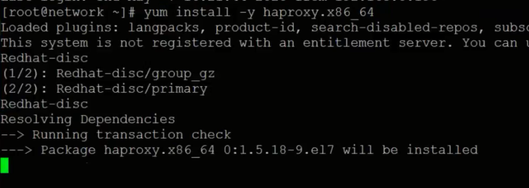
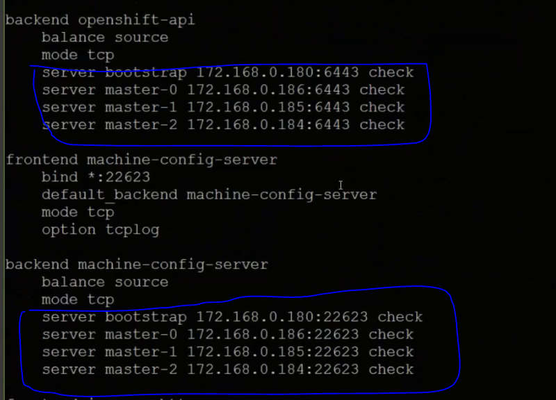
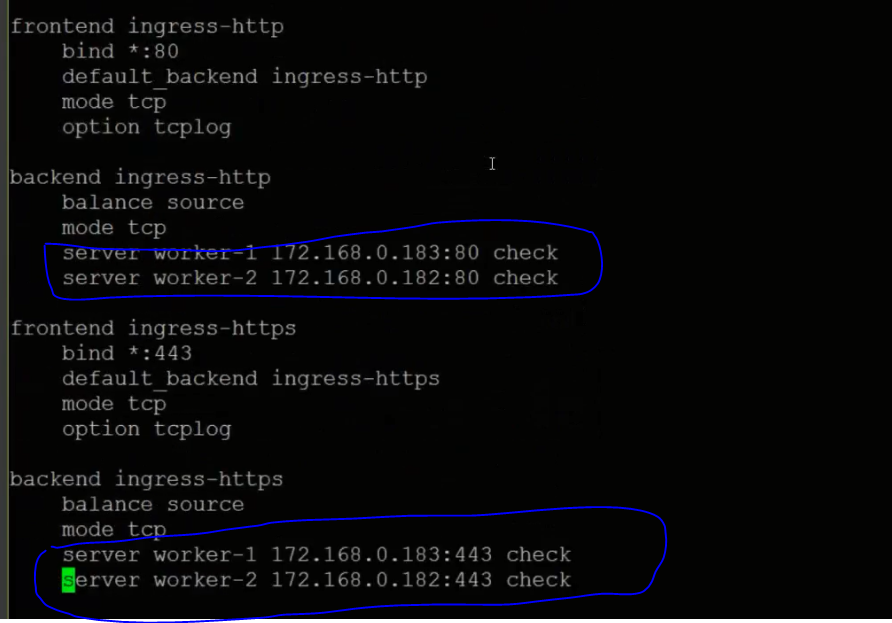
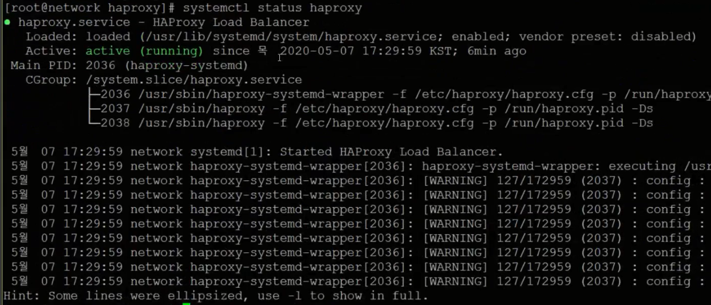

# Infra Servers-HAProxy서버 설치

:::tip TASK DESCRIPTION
Network VM에 HAProxy서버를 설치합니다. 
HAProxy는 S/W적인 Load balancer이며 L/B대상은 api server와 user service들입니다.  
물리적인 L4/L7장비로 Load balancing한다면 필요 없습니다.  
[[toc]] 
:::

## HAProxy서버 설치
Terminal 또는 ssh명령으로 Network VM을 접근합니다. 

```
$ yum install -y haproxy.x86_64
```


## L/B 설정
```
$ cd /etc/haproxy
$ vi haproxy.cfg
```
- api server에 대한 6443, 22623포트 L/B설정을 합니다.  


- user services에 대한 80, 443포트 L/B설정을 합니다.  
L/B node는 ingress controller 서비스가 수행되고 있는 worker node에 대해서만 설정하면 됩니다.  



- 아래 sample파일을 참조하여 셋팅합니다.  
  - 기존 기본 haproxy.cfg에서 'maxconn ...'하위의 내용을 지웁니다.  
  - 아래 sample의 'listen stats ..'부터 복사하여 추가합니다.  
  - IP를 적절하게 변경합니다. 
   
```
SAMPLE

...
defaults
    ...
    maxconn                 3000

listen stats
    bind :9000
    mode http
    stats enable
    stats uri /
    monitor-uri /healthz

frontend openshift-api-server
    bind *:6443
    default_backend openshift-api-server
    mode tcp
    option tcplog

backend openshift-api-server
    balance source
    mode tcp
    server bootstrap 172.168.0.180:6443 check
    server master-0 172.168.0.186:6443 check
    server master-1 172.168.0.185:6443 check
    server master-2 172.168.0.184:6443 check

frontend machine-config-server
    bind *:22623
    default_backend machine-config-server
    mode tcp
    option tcplog

backend machine-config-server
    balance source
    mode tcp
    server bootstrap 172.168.0.180:22623 check
    server master-0 172.168.0.186:22623 check
    server master-1 172.168.0.185:22623 check
    server master-2 172.168.0.184:22623 check

frontend ingress-http
    bind *:80
    default_backend ingress-http
    mode tcp
    option tcplog

backend ingress-http
    balance source
    mode tcp
    server worker-1 172.168.0.183:80 check
    server worker-2 172.168.0.182:80 check

frontend ingress-https
    bind *:443
    default_backend ingress-https
    mode tcp
    option tcplog

backend ingress-https
    balance source
    mode tcp
    server worker-1 172.168.0.183:443 check
    server worker-2 172.168.0.182:443 check

```

## HAProxy서버 시작
```
HAProxy서버를 부팅시 자동 시작하도록 등록
$ systemctl enable haproxy

HAProxy서버 시작
$ systemctl start haproxy

상태확인
$ systemctl status haproxy
```


## haproxy서버로 포트 forwarding
클러스터 외부에 있는 유선네트워크장치 또는 무선공유기(iptime)에서 6443, 22623, 80, 443포트에 대해  
haproxy서버로 포트 forward설정을 합니다.  

---
<disqus/>


