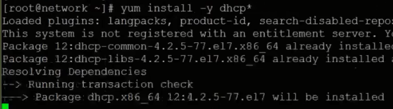
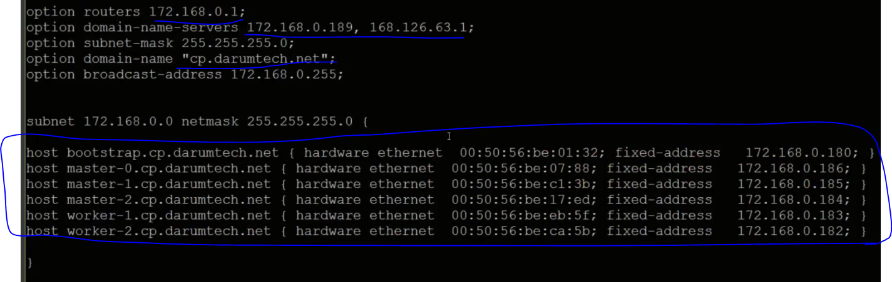
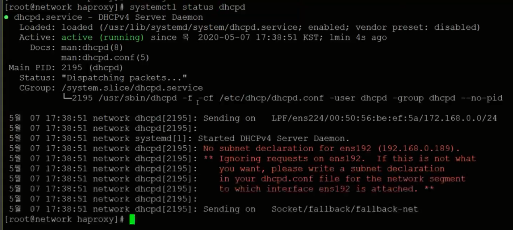

# Infra Servers-DHCP서버 설치

:::tip TASK DESCRIPTION
Network VM에 DHCP서버를 설치합니다.  
DHCP는 bootstrap, master, worker node의 MAC주소와 IP를 고정하기 위해 사용됩니다.    
[[toc]] 
:::

## DHCP서버 설치
Terminal 또는 ssh명령으로 Network VM을 접근합니다. 

```
$ yum install -y dhcp*
```


## DHCP설정
```
$ cd /etc/dhcp
$ vi dhcpd.conf

```

```
SAMPLE

#
# DHCP Server Configuration file.
#   see /usr/share/doc/dhcp*/dhcpd.conf.example
#   see dhcpd.conf(5) man page
#

ddns-update-style interim;
authoritative;

option routers 172.168.0.1;
option domain-name-servers 172.168.0.189, 168.126.63.1;
option subnet-mask 255.255.255.0;
option domain-name "cp.darumtech.net";
option broadcast-address 172.168.0.255;


subnet 172.168.0.0 netmask 255.255.255.0 {


host bootstrap.cp.darumtech.net { hardware ethernet  00:50:56:be:02:32; fixed-address   172.168.0.180; }
host master-0.cp.darumtech.net { hardware ethernet  00:50:56:be:08:88; fixed-address   172.168.0.186; }
host master-1.cp.darumtech.net { hardware ethernet  00:50:56:be:c3:3b; fixed-address   172.168.0.185; }
host master-2.cp.darumtech.net { hardware ethernet  00:50:56:be:19:ed; fixed-address   172.168.0.184; }
host worker-1.cp.darumtech.net { hardware ethernet  00:50:56:be:ed:5f; fixed-address   172.168.0.183; }
host worker-2.cp.darumtech.net { hardware ethernet  00:50:56:be:cb:5b; fixed-address   172.168.0.182; }

}
```

> **TIP**  
  위 sample로 파일을 만든 후 아래와 같이 문자열을 일괄 변경할 수 있습니다.  
  ```
  $ sed -i'' "s/<대상 문자열>/<바꿀 문자열>/g" <파일경로>
  예) sed -i'' "s/darumtech.net/kubepia.com/g" ./dhcpd.conf
  ```  

- router IP, DNS IP, base domain을 지정합니다.  
- bootstrap, master, worker node의 MAC주소와 IP를 지정합니다.   


:::tip ETHERNET ADAPTOR HARDWARE ADDRESS REQUIREMENTS
반드시 아래 범위의 MAC Address를 지정해야 합니다.  
00:05:69:00:00:00 to 00:05:69:FF:FF:FF  
00:0c:29:00:00:00 to 00:0c:29:FF:FF:FF  
00:1c:14:00:00:00 to 00:1c:14:FF:FF:FF  
00:50:56:00:00:00 to 00:50:56:FF:FF:FF  
:::

## DHCP서버 시작
```
DHCP서버를 부팅시 자동 시작하도록 등록
$ systemctl enable dhcpd

DHCP서버 시작
$ systemctl start dhcpd

상태확인
$ systemctl status dhcpd
```


---
<disqus/>
