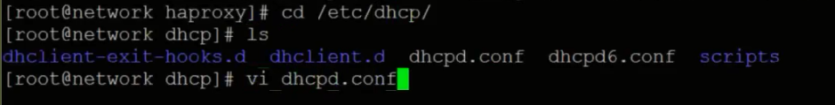

# Infra Servers-DHCP서버 설치

:::tip TASK DESCRIPTION
Network VM에 DHCP서버를 설치합니다.  
DHCP는 bootstrap, master, worker node의 MAC주소와 IP를 고정하기 위해 사용됩니다.    
[[toc]] 
:::

## DHCP서버 설치
Terminal 또는 ssh명령으로 Network VM을 접근합니다. 

```
$ yum install -y dhcp*
```


## DHCP설정
```
$ cd /etc/dhcp
$ vi dhcpd.conf
```


- router IP, DNS IP, base domain을 지정합니다.  
- bootstrap, master, worker node의 MAC주소와 IP를 지정합니다.   


## DHCP서버 시작
```
DHCP서버를 부팅시 자동 시작하도록 등록
$ systemctl enable dhcpd

DHCP서버 시작
$ systemctl start dhcpd

상태확인
$ systemctl status dhcpd
```
