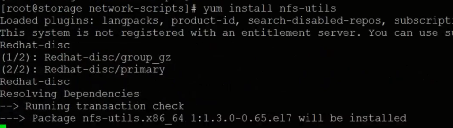
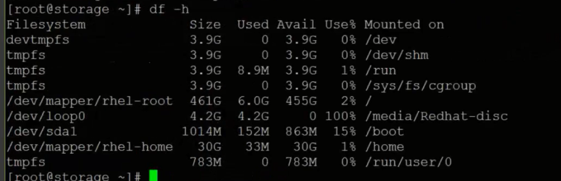
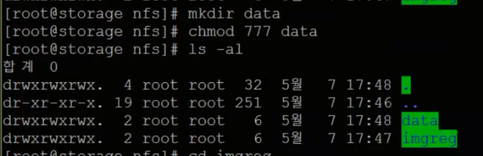
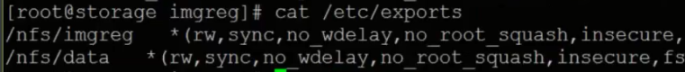
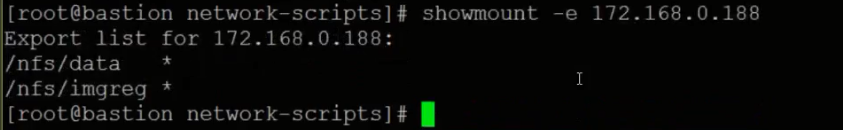
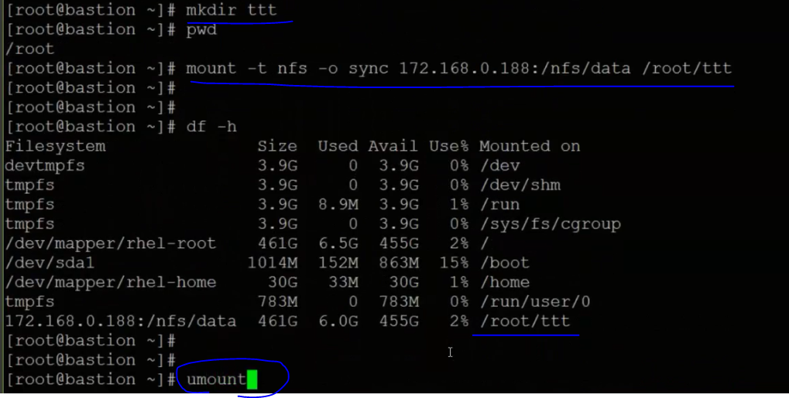
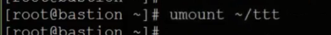

# Infra Servers-NFS서버 설치

:::tip TASK DESCRIPTION
Storage VM에 NFS서버를 설치합니다.  
NFS서버는 File storage유형의 PV(Permanant Volume)를 제공합니다.     
[[toc]] 
:::

## NFS서버 설치
Terminal 또는 ssh명령으로 Storage VM을 접근합니다. 

```
$ yum install -y nfs-utils
```


## NFS서버 설정
- **volume directory를 생성합니다.**  
storage가 어디에 mount되었는지 확인한 후 그 디렉토리에 생성합니다.  

아래는 생성예제입니다.  
data디렉토리는 사용자 서비스용이고, imgreg는 local image registry용입니다.  
```
$ mkdir -p /nfs/data
$ mkdir -p /nfs/imgreg
$ chmod -R 777 /nfs
```



- **/etc/exports파일에 volume directory를 추가합니다.**  

> **참고**  
각 디렉토리의 옵션은 아래와 같습니다.  
    - ro : 읽기 전용  
    - rw : 읽기 및 쓰기 가능  
    - no_root_squash : 클라이언트쪽 root도 서버쪽 root와 같은권한 가짐  
    - no_all_squash : root이외 모든사용자에대해 UID가 같으면 같은 권한을가짐  
    - sync : 서버와 클라이언트사이에 sync를 맞춤  
    - no_wdelay: OCP Local Image Registry용 PV디렉토리는 지정 필요   
    - insecure : 인증 안되도 접속허가  
    - fsid: file storage id

:::tip 중요
- fsid  
  exports파일에서 fsid를 동일한 번호로 지정하지 마십시오.  
  PV생성 시 디렉토리를 지정하여도 동일fsid중 위에 지정된 디렉토리에 무조건 PV가 생성됩니다.  
  fsid를 다른 번호로 지정하거나 아예 fsid를 지정하지 마십시오.
- no_wdelay  
  OCP Local Image Registry용 PV디렉토리는 이 옵션 지정해야 복수개의 Image Registry Pod를 배포할 수 있음
```
$ cat /etc/exports
/nfs/imgreg *(rw,sync,no_wdelay,no_root_squash,insecure,fsid=0)
$ exportfs -rv
exporting *:/mnt/data
```
:::

## NFS서버 시작
```
NFS서버를 부팅시 자동 시작하도록 등록
$ systemctl enable nfs-server

NFS서버 시작
$ systemctl start nfs-server

상태확인
$ systemctl status nfs-server
```

## volume mount 테스트 
다른 VM에서 volume mount가 제대로 되는지 테스트합니다.  
- **nfs-utils 설치**
```
$ yum install -y nfs-utils
```
- **volume directory 조회**
```
$ showmount -e <NFS서버 IP>
```


- **mount test**
```
$ mkdir <temp directory>
$ mount -t nfs -o sync <NFS서버 IP>:<Volume Directory> <temp directory>
$ df -h 
```


제대로 되었으면 unmount하고 임시 디렉토리는 삭제합니다.  
```
$ umount <temp directory>
$ rm -rf <temp directory>
```



---
<disqus/>
