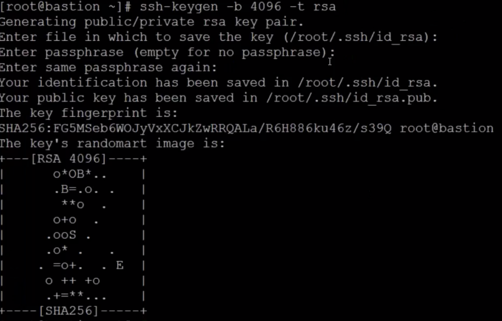
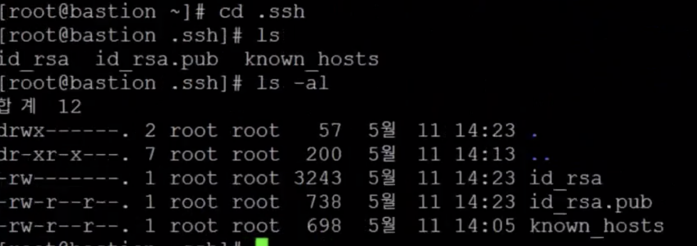
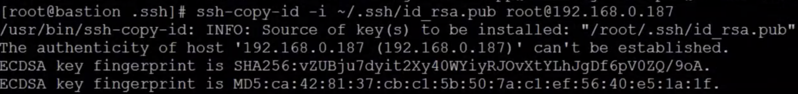
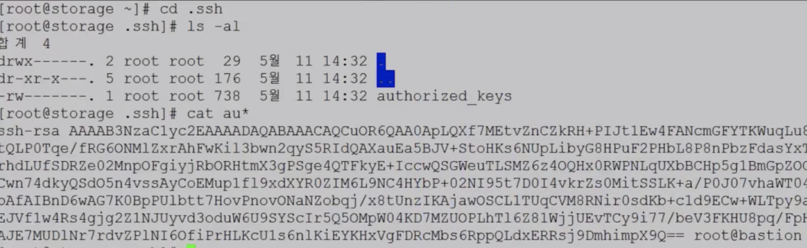
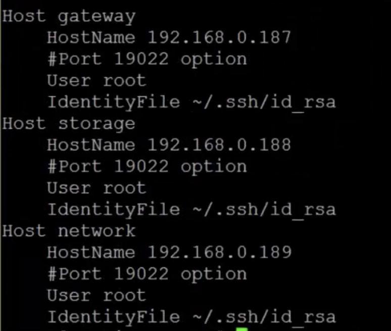
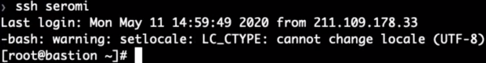

# Infra Servers-SSH Key 구성

:::tip TASK DESCRIPTION
SSH Key를 생성합니다.  
각 VM을 ssh로 쉽게 접근하게 하기 위해 SSH public key를 각 VM에 복사합니다.  
 
[[toc]] 
:::

## SSH Key 생성
Terminal 또는 ssh명령으로 bastion VM을 접근합니다.  
Test용 SSH Key를 생성합니다.   
```
$ ssh-keygen -b 4096 -t rsa
```


현재 user의 HOME디렉토리 하위에 '.ssh'라는 디렉토리가 생깁니다.  
그 디렉토리에 private key파일인 id_rsa와 public key파일인 id_rsa.pub가 생성됩니다.  



## Public SSH Key 복사
ssh로 접근할 각 VM에 public ssh key파일을 복사합니다.  
```
$ ssh-copy-id -i ~/.ssh/id_rsa.pub root@<대상 VM IP>
```


> **참고** \
대상 VM node에는 .ssh/authorized_keys라는 파일로 복사됩니다.\
 


> TIP   
다른 Terminal에서 현재 작업중인 bastion VM도 암호 없이 접근하려면  
위 public key파일 복사를 bastion VM도 해야 합니다.  
```
$ ssh-copy-id -i ~/.ssh/id_rsa.pub root@172.168.0.190
$ ls -al 
합계 20
drwx------. 2 root root   94  5월 28 16:23 .
dr-xr-x---. 6 root root  210  5월 28 16:10 ..
-rw-------. 1 root root  738  5월 28 16:23 authorized_keys
-rw-r--r--. 1 root root  255  5월 28 16:12 config
-rw-------. 1 root root 3243  5월 28 16:10 id_rsa
-rw-r--r--. 1 root root  738  5월 28 16:10 id_rsa.pub
-rw-r--r--. 1 root root  700  5월 28 16:23 known_hosts

위와 같이 'authorized_keys'파일이 생겨야 다른 Terminal에서  
암호없이 이 VM을 접근할 수 있습니다.   
```

## Config파일 생성
각 VM의 정보를 담고 있는 Config파일을 생성합니다.  
```
Host <VM alias>
    HostName <VM IP>
    Port <SSH PORT>
    User <User ID>
    IdentityFile <Private SSH Key파일 경로>
```
예제)  
```
Host gateway
    HostName 172.168.0.187
    User root
    IdentityFile ~/.ssh/id_rsa
Host network
    HostName 172.168.0.189
    User root
    IdentityFile ~/.ssh/id_rsa
Host storage
    HostName 172.168.0.188
    User root
    IdentityFile ~/.ssh/id_rsa
```


:::tip Local Mac에서 Config설정
Mac에서 bastion서버를 쉽게 접근하기 위해  
아래 예와같이 Local Mac의 ~/.ssh/config파일을 생성합니다.  
미리 private key파일은(~/.ssh/keys/seromi_rsa)다운로드 해야 합니다.   

예제)
```
$ mkdir -p ~/.ssh/keys
$ cd ~/.ssh/keys 
$ scp -P 19022 root@61.78.152.243:~/.ssh/id_rsa .
$ cd ~/.ssh
$ vi config 

Host seromi
    HostName 61.78.152.243
    Port 19022
    User root
    IdentityFile ~/.ssh/keys/seromi_rsa

```

:::

## 테스트
- **bastion VM에서 테스트**
ssh나 scp명령 사용 시 이제는 암호를 묻지 않고 바로 접근이 됩니다.   


- **Mac에서 테스트**
Mac에 config파일을 만들었다면, 아래와 같이 ssh로 bastion서버 접근이 되는지 테스트 합니다.  


---
<disqus/>
