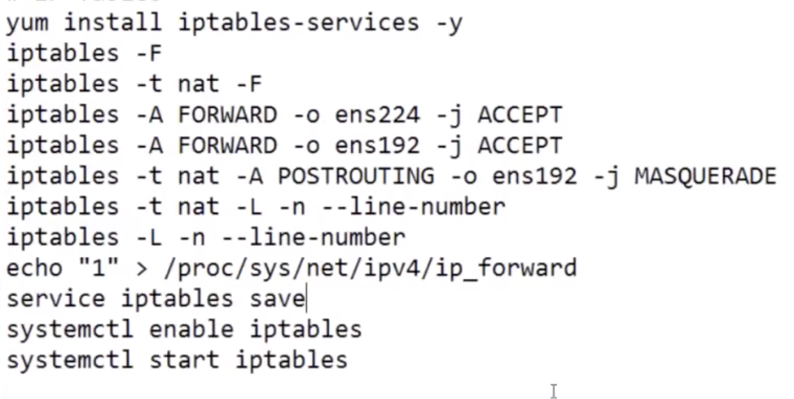
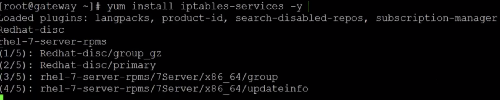
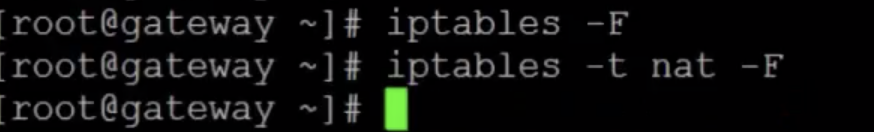
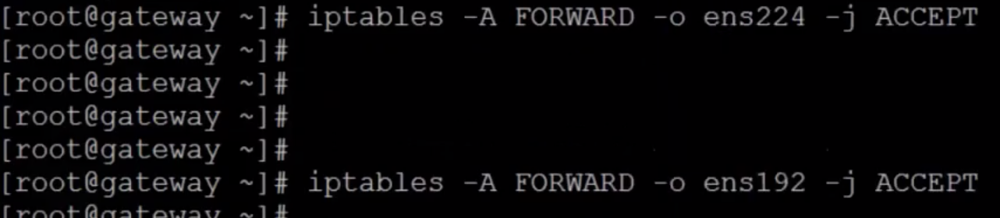
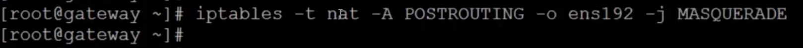
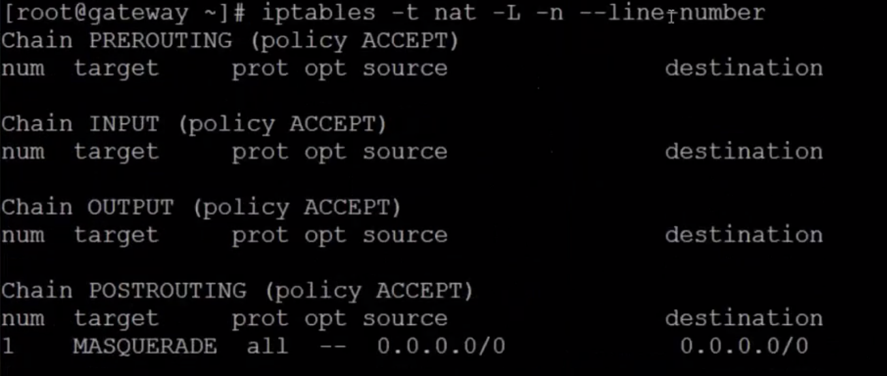
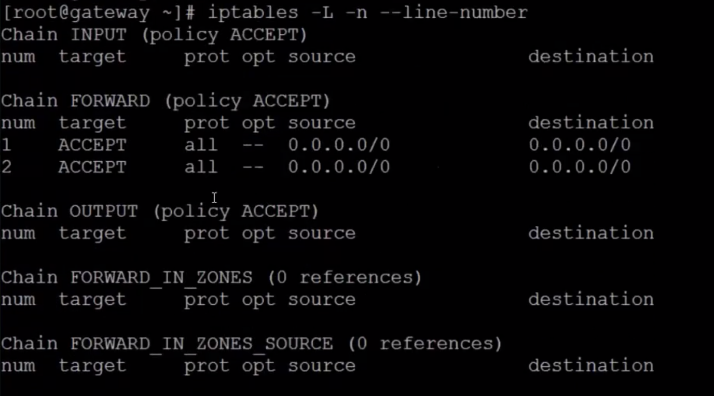
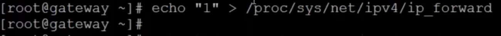
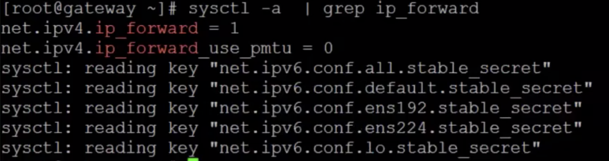
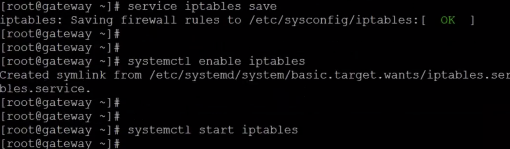

# Infra Servers-iptables 설치

:::tip TASK DESCRIPTION
iptables는 private IP만 부여된 VM(storage, network, master, worker등)들이 외부 public network에 접근하기 위한 gateway역할을 합니다.  
기술적으로는 DNAT(Destination Network Address Translation)역할을 수행하는것입니다.  
예를 들면 172.168.0.* VM들의 gateway인 172.168.0.1로 요청이 들어오면 Public Gateway인 192.168.0.2로 주소를 변환하여 전달하여 외부로 traffic이 나갔다 들어올 수 있도록 합니다.    
참고로 외부 요청을 내부로 전달하기 위한 NAT는 SNAT(Source NAT)이라고 하며, 클러스터 외부의 네트워크 장비(예: 무선공유기 iptime)에 설정합니다.  

아래는 iptables설치 및 작업순서 명령어들입니다.  


[[toc]] 
:::

## iptables서버 설치
gateway VM을 접근합니다.  
ssl key설정을 하였으므 ssh gateway명령으로 바로 접근할 수 있습니다.  
```
$ ssh gateway
$ yum install -y iptables-services
```


## iptables 설정 초기화
기존 설정이 있으면 초기화합니다.  -F는 Flush파라미터입니다.  
```
$ iptables -F
$ iptables -t nat -F
```



##  private/public ip의 요청 Accept설정
ens224는 private ip, ens192는 public ip로 부터의 요청을 의미합니다.  
private/public ip으로부터의 요청을 허용하고 forward설정을 추가합니다.  
```
$ iptables -A FORWARD -o ens224 -j ACCEPT
$ iptables -A FORWARD -o ens192 -j ACCEPT
```


## DNAT 설정 
Public Gateway로 라우팅을 위한 NAT(Network Address Translation)설정을 합니다.   
```
$ iptables -t nat -A POSTROUTING -o ens192 -j MASQUERADE
```


## 설정 확인
```
$ iptables -t nat -L -n --line-number
$ iptables -L -n --line-number
```




## ip forward 활성화
ip forward설정을 enable시킵니다.  
```
$ echo "1" > /proc/sys/net/ipv4/ip_forward
```


:::tip ip forward 영구설정
위 proc에 설정한것은 VM이 재시작되면 사라집니다.  
영구적으로 설정하려면 sysctl명령으로 해야 합니다.  
ip forward는 기본적으로 활성화되어 있으므로 아래와 같이 확인만 해 봅니다.   
```
$ sysctl -a | grep ip_forward
```

:::

> **※ systemctl과 sysctl** \
systemctl은 daemon서비스들에 대한 설정만 control합니다.\
sysctl은 system서비스들에 대한 설정을 control합니다. \
**VM Template을 만들때 sysctl로 system서비스들에 대한 설정을 미리 지정하는것이 좋습니다.**   

## iptables 설정 저장 및 시작
```
$ service iptables save
$ systemctl enable iptables
$ systemctl start iptables
```


**이상으로 Infra Servers설치를 완료하였습니다.**
**이제 OCP설치를 진행하십시오.**

---
<disqus/>
