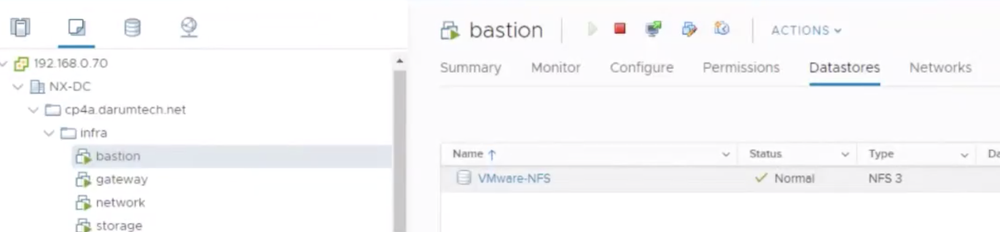
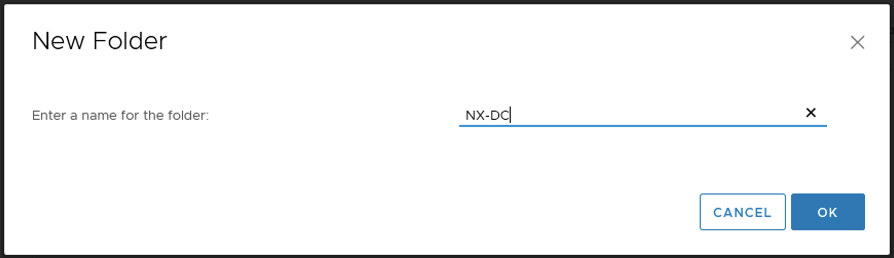

# OCP-ignition파일 및 VM생성

:::tip TASK DESCRIPTION
ignition파일은 RHCOS(RedHat Core OS)가 실행될때 참조하는 제반설정정보입니다.  
openshift-install명령을 이용하여 ignition 파일을 생성합니다.  
생성된 파일의 내용을 base64로 암호화하여 VM Node의 속성으로 등록합니다.  
버전별 설치가이드를 참고하십시오.  
- [OCP4.3 install 가이드](https://docs.openshift.com/container-platform/4.3/installing/installing_vsphere/installing-vsphere.html)  
- [OCP4.4 install 가이드](https://docs.openshift.com/container-platform/4.4/installing/installing_vsphere/installing-vsphere.html)  
본 설치매뉴얼은 vmware vSphere상의 설치를 위해 작성되었습니다.  

[[toc]] 
:::

## 사전준비
- **vSphere버전**  
vSphere 6.5상에도 설치가능하지만 vSphere Version 6.7 U2이상을 권장합니다.  

- **System requirements**
문서상의 최소 사양은 아래와 같습니다.  


경험상 CP4App까지 설치하여 운영하기 위한 사양은 아래와 같습니다.  

| Machine   | vCPU | vRAM | Storage |
|:----------|:-----|:-----|:--------|
| Bootstrap | 8    | 16   | 120     |
| Control plane    | 8    | 32   | 120     |
| Compute    | 16   | 32   | 120     |


Master Node는 최소 3개이상, Worker Node는 최소 2개 이상 필요합니다.  

- **User Provisioned Infra 환경 준비**  
아래와 같은 인프라 환경구성이 필요합니다.   
  - Network connections
  - DNS  
  - L/B  
  - DHCP  
  - Configure Ports
참조: [User provisioned infrastructure](https://docs.openshift.com/container-platform/4.3/installing/installing_vsphere/installing-vsphere.html#installation-network-user-infra_installing-vsphere) 

## 설치 프로그램 다운로드
- **[Redhat 설치 가이드](https://cloud.redhat.com/openshift/install)**으로 로그인합니다.  
그리고 설치 인프라 환경을 선택하십시오.  본 매뉴얼에서는 vmware상에 설치합니다.  


- OS에 맞는 설치 openshift-install, Pull secret값, RHCOS, OC CLI를 다운로드 합니다. 


- openshift-install, OC가 잘 설치되었는지 확인합니다. 


## 설치 작업 디렉토리 생성
install-config.yaml과 ignition파일들이 생성될 설치 작업 디렉토리를 생성합니다.  
```
$ mkdir -p /install/config
```

## install-config.yaml 생성
[Sample install-config.yaml](https://docs.openshift.com/container-platform/4.3/installing/installing_vsphere/installing-vsphere.html#installation-vsphere-config-yaml_installing-vsphere)파일을 참조하여 작성합니다. 

```
Sample

apiVersion: v1
baseDomain: darumtech.net 
compute:
- hyperthreading: Enabled   
  name: worker
  replicas: 2 
controlPlane:
  hyperthreading: Enabled   
  name: master
  replicas: 3 
metadata:
  name: cp 
platform:
  vsphere:
    vcenter: your.vcenter.server 
    username: username 
    password: password 
    datacenter: datacenter 
    defaultDatastore: datastore 
fips: false 
pullSecret: '{"auths": ...}' 
sshKey: 'ssh-ed25519 AAAA...' 
```
각 항목 설정방법은 아래와 같습니다.  
| 항목           | 설명            | 예             |
|:--------------|:---------------|:--------------|
| baseDomain    | 기본 도메인       | kubepia.com   |
| compute.replicas | worker node 수 | 2           |
| controlPlane.replicas | master node 수(3이상의 홀수) | 3           |
| metadata.name | 클러스터 이름. [name].[baseDomain]으로 기본 주소 사용됨 | cp |
| platform.vsphere.vcenter | vSphere vCenter hostname 또는 IP | 192.168.0.70 |
| platform.vsphere.username | vSphere의 username | administrator@vsphere.local |
| platform.vsphere.password | vSphere의 password | passw0rd$ |
| platform.vsphere.datacenter | vSphere Datacenter명 | NX-DC |
| platform.vsphere.defaultDatastore | vSphere의 기본 Datastore | VMware-NFS |
| fips | Disk 암호화 사용 여부 | false |
| pullSecret | site별 SSL token값. 위 설치프로그램 다운로드 시 저장한 pullSecret파일 내용을 붙여넣게 합니다. | 생략 |
| sshKey | [SSHKey 구성](https://kubepia.github.io/cloudpak/cp4app/install/infra08.html)시 생성한 public key파일 내용 | 생략 |


> defaultDatastore확인 \



:::tip 반드시 install-config.yaml 백업
install-config.yaml파일은 OCP 설치를 시작하면 없어집니다.  
반드시 백업파일을 생성하시기 바랍니다.  
```
$ cp install-config.yaml install-config-org.yaml
```

:::

## install manifest파일 생성 및 수정 
설치 관련 설정 내용을 담고 있는 manifest파일들을 생성합니다.  
이 단계는 특별히 수정할게 없으면 생략해도 됩니다.  
'installation_directory'는 install-config.yaml파일이 있는 디렉토리입니다.  
```
$ openshift-install create manifests --dir=<installation_directory>
```


manifest파일들은 <installation_directory>/manifests디렉토리에 생성됩니다.  


'cluster-scheduler-02-config.yml'파일에서 'mastersSchedulable'의 값을 'false'로 변경합니다.  
Master node에 Pod가 배포되지 않도록 하기 위함입니다.  


## ignition 파일 생성
RHCOS 부팅 시 참조하는 ignition파일들을 생성합니다.  
```
$ openshift-install create ignition-configs --dir=<installation_directory> 

아래와 같은 구조로 파일들이 생성됩니다.  
auth/kubeadmin-password는 kubeadmin사용자의 암호이고,  
auth/kubeconfig는 cluster로그인 설정정보입니다.  
kubeconfig파일은 사용할 Terminal의 <HOME>/.kube/config파일로 복사하면  
cluster에 인증되어 접근할 수 있습니다.   
.
├── auth
│   ├── kubeadmin-password
│   └── kubeconfig
├── bootstrap.ign
├── master.ign
├── metadata.json
└── worker.ign
```

## append-bootstrap.ign파일 생성
각 Node용 VM을 생성할 때 ignition파일의 내용을 base64 encoding하여 셋팅하여야 합니다.  
그런데 bootstrap.ign의 내용이 너무 많아 길이 제한에 걸려  
base64 encoding한 값을 셋팅할 수 없습니다.   
그래서 bootstrap.ign파일을 Web서버에 업로드하고,  
그 주소를 지정한 append-bootstrap.ign파일을 생성하여 셋팅합니다.  

```
{
  "ignition": {
    "config": {
      "append": [
        {
          "source": "<bootstrap_ignition_config_url>", 
          "verification": {}
        }
      ]
    },
    "timeouts": {},
    "version": "2.1.0"
  },
  "networkd": {},
  "passwd": {},
  "storage": {},
  "systemd": {}
}
```

- bootstrap VM에 [Web서버가 설치](https://kubepia.github.io/cloudpak/cp4app/install/infra02.html)되어 있습니다.  
home디렉토리인 /var/www/html하위에 install디렉토리를 만들고 bootstrap.ign파일을 복사합니다.    


- 아래 예제와 같이 bootstrap.ign파일의 주소를 지정합니다.  


## ignition파일 base64 encoding
base64 encoding한 ignition파일들을 생성합니다.  
```
$ base64 -w0 <installation_directory>/master.ign > <installation_directory>/master.64
$ base64 -w0 <installation_directory>/worker.ign > <installation_directory>/worker.64
$ base64 -w0 <installation_directory>/append-bootstrap.ign > <installation_directory>/append-bootstrap.64
```


## VM Template 작성
각 Node VM을 만들 VM Template을 생성합니다.  
- **RHCOS image인 ova파일을 다운로드 합니다.**  
  - [Redhat 설치페이지](https://cloud.redhat.com/openshift/install)을 로그인  
  - 설치할 IaaS선택. 이 매뉴얼에서는 vmware선택  
  - 'Red Hat Enterprise Linux CoreOS (RHCOS)'의 [Download RHCOS] 버튼 클릭  
  - 'rhcos-[version]-x86_64-vmware.x86_64.ova'클릭하여 다운로드  
   

- **작업폴더를 생성합니다.**  
  - vSphere Client로그인  
  - 좌측에서 'VMs and Templates' 탭 클릭->우측마우스메뉴에서 'New Folder > New VM and Template Folder'선택  
    
  - install-config.yaml의 'platform.vsphere.datacenter'에 입력한 datacenter명 입력   
  
  - 위 작성한 datacenter선택->우측마우스메뉴에서 'New Folder'클릭  
  
  - 'templates'폴더 생성  
  

- **VM Template을 작성합니다.**  
  - PC에 다운로드한 ova파일을 복사-붙여넣기하여 vcenter vm으로 복사   
  - 'templates'폴더 선택->우측마우스메뉴에서 'Deploy OVF Template'클릭  
  
  - 'Local file'선택하고 ova파일 위치 지정  
  
  - template명과 folder선택  
  
  - Compute resource는 아무거나 선택  
  
  - 선택내용 review  
  
  - Virtual Disk format은 'Thin Provision'선택하고 Storage선택  
  
  - Network은 'VM Network'선택  
  
  - 'Customize template'은 Skip함  
  
  - 'Ready to complete'에서 마지막으로 설정 내용 검토하고 [FINISH]클릭  
  
  - 생성된 VM선택->우측마우스메뉴에서 'Template->Convert to template'클릭  
  

## Bootstrap Node VM 생성

## Master Node VM 생성

## Worker Node VM 생성

