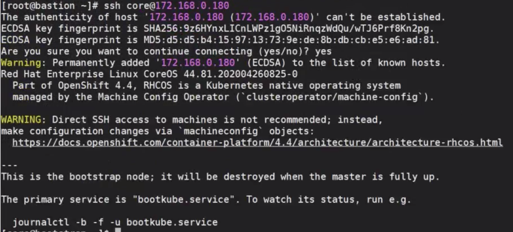
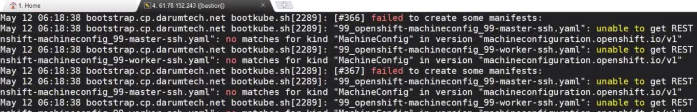
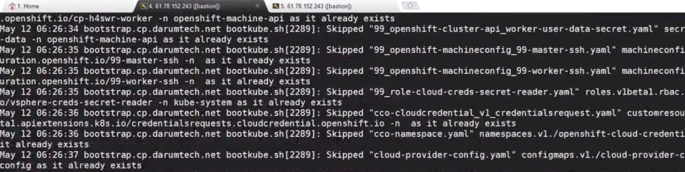
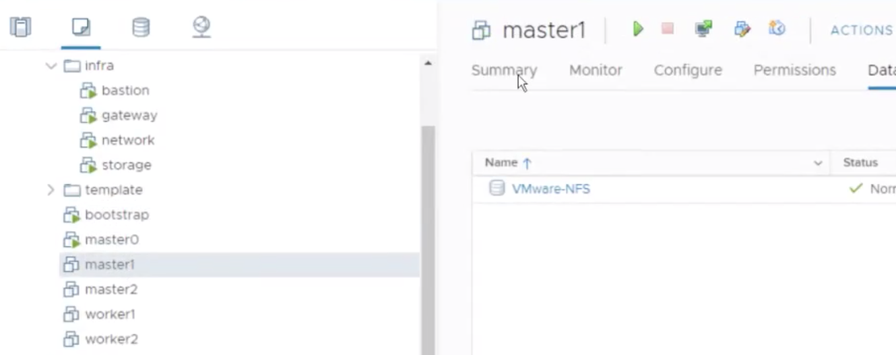
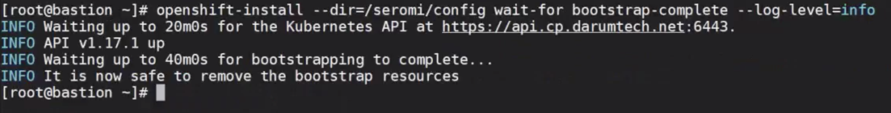
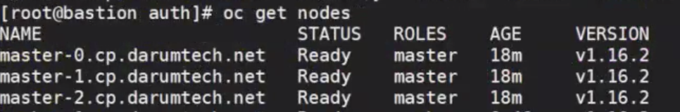
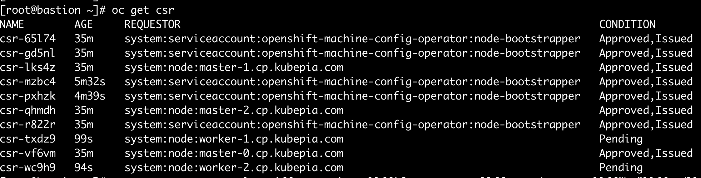
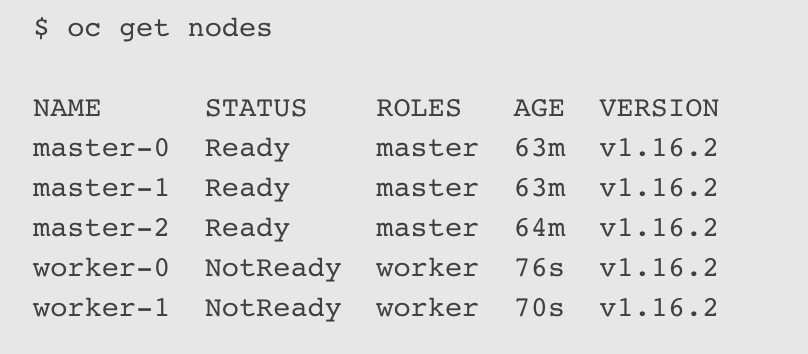
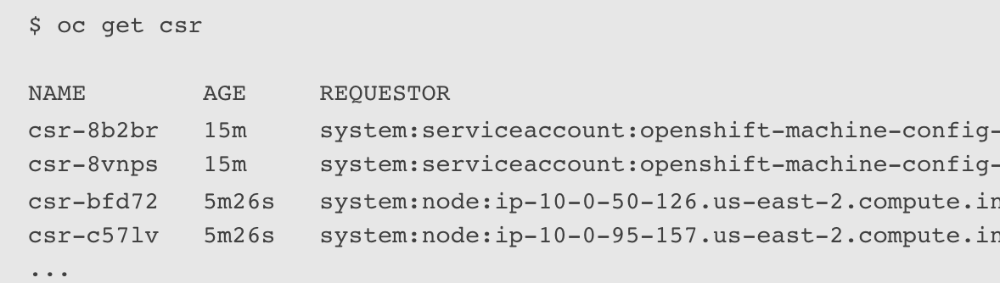
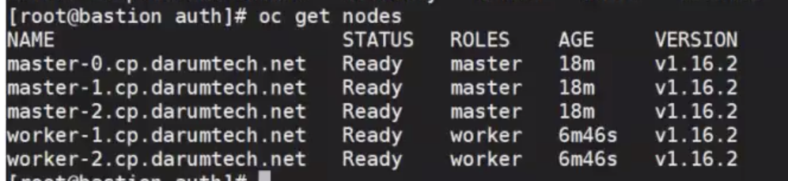

# OCP-OCP 설치

:::tip TASK DESCRIPTION
OCP를 설치합니다.  
※ **중요: OCP설치 후 24시간이상 실행 필요**  
OCP를 최초 설치할때는 내부 TLS통신을 위해 임시 key파일을 사용합니다.  
이 TLS Key파일은 설치 후 24시간내에 자동으로 갱신됩니다.    
따라서 24시간동안은 Master/Worker Node를 정지시키면 안됩니다.  
(참고: 잠깐 내렸다 올리는 건 괜찮습니다.)  

[[toc]] 
:::

:::tip
설치 시 [screen: 가상터미널을 이용한 백그라운드 명령 실행](https://happycloud-lee.tistory.com/119)을 이용하여 보십시오.  
실수나 네트워크 단절로 Terminal이 끊어져도 안전하게 설치를 진행할 수 있습니다.   
:::

## bootstrap, Master node VM 부팅
VM을 부팅시키면 ignition설정에 의해 설치가 자동으로 시작됩니다.  

- **bootstrap VM부터 먼저 시작합니다.**  

bootstrap의 로그를 보고 정상적으로 올라오면 Master VM들을 부팅합니다.  
bootstrap으로 접근하여 설치 로그를 봅니다.  
```
RHCOS를 사용하는 VM들은 'core'라는 user로 로그인해야 합니다.  
$ ssh core@<bootstrap IP>
$ journalctl -b -f
```


- **Master Node 실행**   
bootstrap에 ip가 할당되면 ssh로 접근이 됩니다.  
ssh로 bootstrap로그인이 되면 master node들을 시작합니다.  

bootstrap의 journalctl -b -f로 보면,  
처음에는 에러 메시지가 매우 많이 나옵니다.   


계속 기다리면 에러 메시지가 없어지고 설치가 되는것을 확인할 수 있습니다.  



:::tip Troubleshooting
- **에러:'emergency.service: Failed to set up standard input: Inappropriate ioctl for device'**  
ignition 내용이 틀린 경우 발생합니다.  
base64 내용 처음 또는 끝에 이상한 글자가 있는지 확인해 보십시오.  
만약 ignition data가 틀렸다면 VM을 지우고 다시 만들면서  
정상적인 ignition data를 넣으셔야 합니다.  
최초 부팅 전 Snapshot이 있다면 그걸 복원하고,   
맞는 ignition data를 넣으십시오.  

- **에러: ssh core@[Node IP]로 인증이 안될 때**    
web console에 'Login:'까지 나오고 IP도 정상할당 되었는데  
bastion에서 ssh core@[node ip]로 인증이 안되는 경우입니다.  
install-config.yaml에 지정한 sshKey값이 틀렸습니다.  
bastion의 ~/.ssh/id_rsa.pub의 내용과 install-config.yaml백업본의 내용을 비교하십시오.  
이 경우는 [install-config.yaml파일 생성](https://kubepia.github.io/cloudpak/cp4app/install/ocp01.html#install-config-yaml-%EC%83%9D%EC%84%B1)단계로 돌아가셔서 다시 시작하십시오.  

- **에러: quay.io에서 image pulling을 못할때**  
  - bootstrap만 실행하고, master vm을 시작하지 않으면 발생합니다.  
    Master VM을 모두 시작하십시오.  
  - ssh로 bootstrap을 로그인한 후 'journalctl -b -f'로 로그를 봤을 때  
    quay.io, cloud.openshift.com등을 못찾는 경우 원인은   
    bootstrap에서 외부 인터넷으로 통신이 안되는 경우입니다.  
    cluster의 master/worker node는 gateway VM에 설치된 iptables를 통해 외부와 통신하게 됩니다.  
    그런데 gateway가 연결이 안되기 때문에 외부와의 통신이 안되는 것입니다.  
    [Infra VM Private IP설정](https://kubepia.github.io/cloudpak/cp4app/install/infra03.html#private-ip-%EC%85%8B%ED%8C%85)을 참조하여 gateway VM의 ip를 수정하십시오.  
    수정후에는 'systemctl restart network'을 반드시 수행하십시오.  
  - 위 문제 해결 후에도 image pulling이 안되는 경우  
    install-config.yaml에 지정한 pullSecret값이 권한이 없는 token값입니다.  
    infra VM에서 subscription-manager로 등록한 user의 pullSecret으로 변경하십시오.  
    이 경우는 [install-config.yaml파일 생성](https://kubepia.github.io/cloudpak/cp4app/install/ocp01.html#install-config-yaml-%EC%83%9D%EC%84%B1)단계로 돌아가셔서 다시 시작하십시오. 
:::

- **Worker Node 실행**  
Worker VM들은 Master node의 상태가 Ready가 된 후에 시작하십시오.  


## 설치완료 여부 확인
설치는 네트워크 상황에 따라 약 20~30여분정도 소요됩니다.  
설치완료 여부는 아래 명령으로 확인할 수 있습니다.  
```
$ openshift-install --dir=<installation_directory> wait-for bootstrap-complete --log-level=info
```



## Master node 준비여부 확인 
kubeconfig파일을 [HOME]/.kube/config로 복사한 후 node의 상태를 확인합니다.  

```
$ mkdir ~/.kube
$ cp <intallation_directory>/auth/kubeconfig ~/.kube/config
$ oc get nodes
```




## Worker Node VM 부팅
Worker node VM들을 부팅합니다.  

## Worker node 승인
Worker node들을 cluster에 join시키기 위해서는 CSR(Certificate Signing Requests)을 승인해야 합니다.  
```
Worker node들의 상태가 'Not Ready'로 보임   
$ oc get nodes

CSR승인대기 중인 node 리스트 보기  
$ oc get csr


CSR승인
$ oc adm certificate approve <csr_name> 

모든 CSR승인
$ oc get csr -o go-template='{{range .items}}{{if not .status}}{{.metadata.name}}{{"\n"}}{{end}}{{end}}' | xargs oc adm certificate approve
```





:::tip
- 'watch oc get co'명령을 실행하고, Cluster Operator들의 Available이  
   모두 True가 될때까지 가끔 'oc get csr'명령을 실행하여 대기중인 CSR리스트를 확인합니다.  
   대기중인 CSR이 있으면 모든 CSR승인 명령으로 승인합니다.    
- ssh로 master, worker도 암호 없이 들어갈 수 있도록 설정합니다.  
bastion서버의 ~/.ssh/config파일에 node정보를 추가합니다.  

```
예시)

Host gateway
    HostName 172.168.0.187
    User root
    IdentityFile ~/.ssh/id_rsa
Host network
    HostName 172.168.0.189
    User root
    IdentityFile ~/.ssh/id_rsa
Host storage
    HostName 172.168.0.188
    User root
    IdentityFile ~/.ssh/id_rsa
Host bootstrap
    HostName 172.168.0.180
    User core
    IdentityFile ~/.ssh/id_rsa
Host master-0
    HostName 172.168.0.186
    User core
    IdentityFile ~/.ssh/id_rsa
Host master-1
    HostName 172.168.0.185
    User core
    IdentityFile ~/.ssh/id_rsa
Host master-2
    HostName 172.168.0.184
    User core
    IdentityFile ~/.ssh/id_rsa
Host worker-1
    HostName 172.168.0.183
    User core
    IdentityFile ~/.ssh/id_rsa
Host worker-2
    HostName 172.168.0.182
    User core
    IdentityFile ~/.ssh/id_rsa
```

※ ABOUT ~/.ssh/known_hosts파일  
ssh로 VM로그인이 성공하면 이 파일에 대상 VM정보가 등록됩니다.  
만약 어떤 VM을 재작성하거나 sshkey를 다시 만들었다면 이 파일을 먼저 지우시고,  
접근하셔야 정상적으로 인증이 됩니다.   
:::

## 최종 확인
node들의 상태를 확인합니다.  


아래 리스트가 OCP의 Cluster Component들입니다.  
이 기본 Component들은 Cluster Operator로 설치됩니다.  
모든 Component의 Avaiable상태가 True가 될때까지 기다립니다.  
```
$ watch -n5 oc get clusteroperators
※ clusteroperators는 약어인 co를 사용해도 됩니다.  

NAME                                 VERSION   AVAILABLE   PROGRESSING   DEGRADED   SINCE
authentication                       4.3.0     True        False         False      69s
cloud-credential                     4.3.0     True        False         False      12m
cluster-autoscaler                   4.3.0     True        False         False      11m
console                              4.3.0     True        False         False      46s
dns                                  4.3.0     True        False         False      11m
image-registry                       4.3.0     True        False         False      5m26s
ingress                              4.3.0     True        False         False      5m36s
kube-apiserver                       4.3.0     True        False         False      8m53s
kube-controller-manager              4.3.0     True        False         False      7m24s
kube-scheduler                       4.3.0     True        False         False      12m
machine-api                          4.3.0     True        False         False      12m
machine-config                       4.3.0     True        False         False      7m36s
marketplace                          4.3.0     True        False         False      7m54m
monitoring                           4.3.0     True        False         False      7h54s
network                              4.3.0     True        False         False      5m9s
node-tuning                          4.3.0     True        False         False      11m
openshift-apiserver                  4.3.0     True        False         False      11m
openshift-controller-manager         4.3.0     True        False         False      5m943s
openshift-samples                    4.3.0     True        False         False      3m55s
operator-lifecycle-manager           4.3.0     True        False         False      11m
operator-lifecycle-manager-catalog   4.3.0     True        False         False      11m
service-ca                           4.3.0     True        False         False      11m
service-catalog-apiserver            4.3.0     True        False         False      5m26s
service-catalog-controller-manager   4.3.0     True        False         False      5m25s
storage                              4.3.0     True        False         False      5m30s
```

OCP Web console로 로그인합니다. 
| 항목 | 설명 | 예 |
|:--------- |:-------------|:----------|
| 주소 | https://console-openshift-console.apps.[cluster name].[base domain] | https://console-openshift-console.apps.hcp.kubepia.com |
| username | kubeadmin | - |
| password | bastion VM의 [install directory]/config/auth/kubeadmin-password파일 참조 | 생략  |

---
<disqus/>
