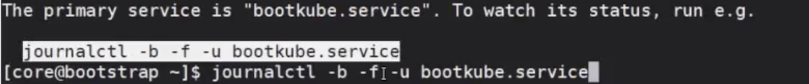

# OCP-OCP 설치

:::tip TASK DESCRIPTION
OCP를 설치합니다.  
※ **중요: OCP설치 후 24시간이상 실행 필요**  
OCP를 최초 설치할때는 내부 TLS통신을 위해 임시 key파일을 사용합니다.  
이 TLS Key파일은 설치 후 24시간내에 자동으로 갱신됩니다.    
따라서 24시간동안은 Master/Worker Node를 정지시키면 안됩니다.  
(참고: 잠깐 내렸다 올리는 건 괜찮습니다.)  

[[toc]] 
:::

## bootstrap, Master node VM 부팅
VM을 부팅시키면 ignition설정에 의해 설치가 자동으로 시작됩니다.  
bootstrap VM부터 먼저 시작합니다.  
조금 이따가 Master VM들을 부팅합니다.  
Worker VM들도 같이 부팅해도 되나, 실패할수도 있으므로 Master node가 정상적으로 설치된 후에 시작하십시오.  


## bootstrap console log 보기  
bootstrap으로 접근하여 설치 로그를 봅니다.  
```
RHCOS를 사용하는 VM들은 'core'라는 user로 로그인해야 합니다.  
$ ssh core@<bootstrap IP>
$ journalctl -b -f -u bootkube.service
```


로그인 후 안내 메시지에 나오는 journalctl명령을 실행합니다.  


처음에는 에러 메시지가 매우 많이 나옵니다.   


계속 기다리면 에러 메시지가 없어지고 설치가 되는것을 확인할 수 있습니다.  


## 설치완료 여부 확인
설치는 약 15~20여분정도 소요됩니다.  
설치완료 여부는 아래 명령으로 확인할 수 있습니다.  
```
$ openshift-install --dir=<installation_directory> wait-for bootstrap-complete --log-level=info
```


## Master node 준비여부 확인 
kubeconfig파일을 [HOME]/.kube/config로 복사한 후 node의 상태를 확인합니다.  

```
$ mkdir ~/.kube
$ cp <intallation_directory>/auth/kubeconfig ~/.kube/config
$ oc get nodes
```


## Worker Node VM 부팅
Worker node VM들을 부팅합니다.  

## Worker node 승인
install-config.yaml에 worker node수를 지정하면 최초 설치시에는 자동으로 worker node가 추가됩니다.  
추가된 Worker node들을 cluster에 join시키기 위해서는 CSR(Certificate Signing Requests)를 승인해야 합니다.  
```
Worker node들의 상태가 'Not Ready'로 보임   
$ oc get nodes

CSR승인대기 중인 node 리스트 보기  
$ oc get csr

CSR승인
$ oc adm certificate approve <csr_name> 

모든 CSR승인
$ oc get csr -o go-template='{{range .items}}{{if not .status}}{{.metadata.name}}{{"\n"}}{{end}}{{end}}' | xargs oc adm certificate approve
```


## 최종 확인
node들의 상태를 확인합니다.  


OCP Web console로 로그인합니다. 
| 항목 | 설명 | 예 |
|:--------- |:-------------|:----------|
| 주소 | https://console-openshift-console.apps.[cluster name].[base domain] | https://console-openshift-console.apps.hcp.kubepia.com |
| username | kubeadmin | - |
| password | bastion VM의 [install directory]/config/auth/kubeadmin-password파일 참조 | 생략  |

---
<disqus/>
