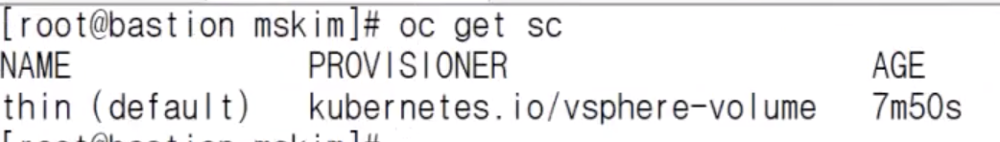

# OCP-Local Image Registry 구성

:::tip TASK DESCRIPTION
OCP는 각 Cluster마다 Local Image Registry가 필요합니다.  
Local Image Registry구성이 안되면 OCP자체의 CI/CD를 사용할수가 없습니다.   

[[toc]] 
:::

## 기본 image registry Pod 삭제
Local image registry는 image-registry라는 cluster operator로 설치됩니다.    


## StorageClass 생성
vmware의 기본 Storageclass인 thin의 accessMode는 ReadWriteOnce만 지원합니다.  


local image registry용 PV는 ReadWriteMany가 필요하기 때문에  
이를 지원하는 storageclass를 만들어야 합니다.  
reclaimPolicy가 Delete인 storageclass와 Retain인 storageclass를 만듭니다.  
- **reclaimPolicy: Delete**
```
$ vi sc-nfs-delete.yaml

apiVersion: storage.k8s.io/v1
kind: StorageClass
metadata:
  annotations:
    storageclass.kubernetes.io/is-default-class: "true"
  name: nfs-delete
provisioner: standard
reclaimPolicy: Delete
volumeBindingMode: Immediate

$ oc apply -f sc-nfs-delete.yaml
```

- **reclaimPolicy: Delete**
```
$ vi sc-nfs-retain.yaml

apiVersion: storage.k8s.io/v1
kind: StorageClass
metadata:
  name: nfs-retain
provisioner: standard
reclaimPolicy: Retain
volumeBindingMode: Immediate

$ oc apply -f sc-nfs-retain.yaml
```

## PV/PVC 생성

:::tip 중요
**no_wdelay**  
  OCP Local Image Registry용 PV디렉토리는 이 옵션을 지정해야  
  복수개의 Image Registry Pod를 배포할 수 있습니다.    
  Storage VM에서 exports파일 내용 확인하고 no_wdelay옵션이 없으면 추가하십시오.  
```
$ cat /etc/exports
/nfs/imgreg *(rw,sync,no_wdelay,no_root_squash,insecure,fsid=0)
$ exportfs -rv
exporting *:/mnt/data
```
:::

- **PV생성**

```
$ vi image-registry-pv.yaml 

apiVersion: v1
kind: PersistentVolume
metadata:
  name: image-registry-pv
spec:
  accessModes:
    - ReadWriteMany
  capacity:
    storage: 100Gi
  nfs:
    server: <nfs server ip>
    path: <nfs volume directory>
  persistentVolumeReclaimPolicy: Retain
  storageClassName: nfs-retain

$ oc apply -f image-registry-pv.yaml -n openshift-image-registry
```


- **PVC생성**
```
$ vi image-registry-pvc.yaml

apiVersion: "v1"
kind: "PersistentVolumeClaim"
metadata:
  name: "image-registry-pvc"
spec:
  accessModes:
    - ReadWriteMany
  resources:
    requests:
      storage: 100Gi
  storageClassName: nfs-retain
  volumeMode: Filesystem

$ oc apply -f image-registry-pvc.yaml -n openshift-image-registry
$ oc get pvc -n openshift-image-registry
```

## image registry POD생성
- **imageregistry config 변경**  
```
- storage.pvc이름 셋팅  
$ oc edit configs.imageregistry.operator.openshift.io -o yaml  
...  
storage:  
  pvc:  
    claim: image-registry-pvc  
...  


- managementState를 Managed로 변경    
```


image-registry cluster-operator의 상태를 확인합니다.  
```
$ watch oc get co image-registry
```


Available이 True로 변경될때까지 기다립니다.  


Pod가 정상적으로 실행되는지 확인합니다.  
```
$ oc get po -n openshift-image-registry
```


---
<disqus/>
