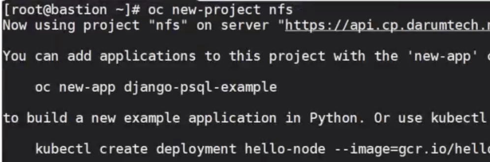
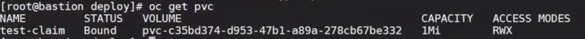
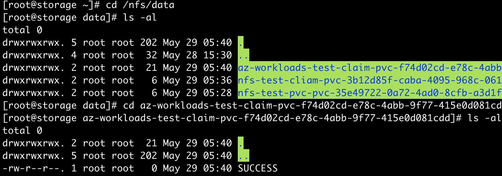

# OCP-NFS Dynamic provisioning

:::tip TASK DESCRIPTION
PV Binding이 자동으로 되도록 NFS Dynamic provisioning 설정을 합니다.  
NFS dynamic provisioning을 하기 위한 nfs-provisioner Pod를 배포합니다.  
[github의 external-storage](https://github.com/kubernetes-incubator/external-storage)를 참조하십시오.  

[[toc]] 
:::

## git 설치  
```
$ yum install -y git 
```

## nfs provisioner용 namespace 생성
```
$ oc new-project nfs
```



## nfs-provisioner 다운로드  
```
$ mkdir -p /nfsprovider
$ cd /nfsprovider
$ git clone https://github.com/kubernetes-incubator/external-storage.git
$ cd external-storage/nfs-client/
```

## Service Account 생성 및 권한 설정
```
현재 namespace를 nfs로 변경  
$ oc project nfs  

rbac.yaml내의 namespace를 모두 ‘nfs’로 변경하고 적용함    
$ NAMESPACE=`oc project -q`
$ sed -i'' "s/namespace:.*/namespace: $NAMESPACE/g" ./deploy/rbac.yaml  
$ oc apply -f deploy/rbac.yaml

service account 'nfs-client-provisioner'에게 hostmount-anyuid SCC적용  
$ oc adm policy add-scc-to-user hostmount-anyuid -z nfs-client-provisioner
```

**rbac.yaml**  
Service Account 'nfs-client-provisioner'을 만들고 필요한 role을 binding합니다.   
```
apiVersion: v1
kind: ServiceAccount
metadata:
  name: nfs-client-provisioner
  # replace with namespace where provisioner is deployed
  namespace: nfs
---
kind: ClusterRole
apiVersion: rbac.authorization.k8s.io/v1
metadata:
  name: nfs-client-provisioner-runner
rules:
  - apiGroups: [""]
    resources: ["persistentvolumes"]
    verbs: ["get", "list", "watch", "create", "delete"]
  - apiGroups: [""]
    resources: ["persistentvolumeclaims"]
    verbs: ["get", "list", "watch", "update"]
  - apiGroups: ["storage.k8s.io"]
    resources: ["storageclasses"]
    verbs: ["get", "list", "watch"]
  - apiGroups: [""]
    resources: ["events"]
    verbs: ["create", "update", "patch"]
---
kind: ClusterRoleBinding
apiVersion: rbac.authorization.k8s.io/v1
metadata:
  name: run-nfs-client-provisioner
subjects:
  - kind: ServiceAccount
    name: nfs-client-provisioner
    # replace with namespace where provisioner is deployed
    namespace: nfs
roleRef:
  kind: ClusterRole
  name: nfs-client-provisioner-runner
  apiGroup: rbac.authorization.k8s.io
---
kind: Role
apiVersion: rbac.authorization.k8s.io/v1
metadata:
  name: leader-locking-nfs-client-provisioner
  # replace with namespace where provisioner is deployed
  namespace: nfs
rules:
  - apiGroups: [""]
    resources: ["endpoints"]
    verbs: ["get", "list", "watch", "create", "update", "patch"]
---
kind: RoleBinding
apiVersion: rbac.authorization.k8s.io/v1
metadata:
  name: leader-locking-nfs-client-provisioner
  # replace with namespace where provisioner is deployed
  namespace: nfs
subjects:
  - kind: ServiceAccount
    name: nfs-client-provisioner
    # replace with namespace where provisioner is deployed
    namespace: nfs
roleRef:
  kind: Role
  name: leader-locking-nfs-client-provisioner
  apiGroup: rbac.authorization.k8s.io
```

## storageclass 생성
[OCP Local Image Registry 구성](https://kubepia.github.io/cloudpak/cp4app/install/ocp03.html)시 생성한 nfs-delete, nfs-retain외에 더 필요한 storage class가 있으면 생성합니다.  
```
storageclass YAML sample 

apiVersion: storage.k8s.io/v1
kind: StorageClass
metadata:
  name: nfs-standard
provisioner: standard
reclaimPolicy: Retain
volumeBindingMode: Immediate
```
​
## nfs-provisioner Pod 배포
- **NFS서버 및 디렉토리 수정, namespace를 ‘nfs’로 변경**   
```
$ sed -i'' "s/namespace:.*/namespace: $NAMESPACE/g" ./deploy/deployment.yaml  
```

- **deployment.yaml수정**  
아래 항목을 적절하게 수정합니다.  
  - env.PROVISIONER_NAME: storage class에 지정한 provisioner name과 동일하게 변경
  - env.NFS_SERVER, volumes.nfs.server: nfs server의 IP  
  - env.NFS_PATH, volumes.nfs.path: nfs server에 미리 만든 자동으로 volume이 생성될 상위 디렉토리  
nfs_path디렉토리 하위에 자동으로 PVC별 디렉토리가 생성됩니다.  
> **중요**  
StorageClass생성 시 Provioner를 'kubernetes.io/no-provisioner'로 주면,  
Dynamic provisoning이 안됩니다.  

```
SAMPLE

apiVersion: apps/v1
kind: Deployment
metadata:
  name: nfs-client-provisioner
  labels:
    app: nfs-client-provisioner
  # replace with namespace where provisioner is deployed
  namespace: nfs
spec:
  replicas: 1
  strategy:
    type: Recreate
  selector:
    matchLabels:
      app: nfs-client-provisioner
  template:
    metadata:
      labels:
        app: nfs-client-provisioner
    spec:
      serviceAccountName: nfs-client-provisioner
      containers:
        - name: nfs-client-provisioner
          image: quay.io/external_storage/nfs-client-provisioner:latest
          volumeMounts:
            - name: nfs-client-root
              mountPath: /persistentvolumes
          env:
            - name: PROVISIONER_NAME
              value: standard
            - name: NFS_SERVER
              value: 10.40.89.158
            - name: NFS_PATH
              value: /nfs/data
      volumes:
        - name: nfs-client-root
          nfs:
            server: 10.40.89.158
            path: /nfs/data
```

- **Pod 생성**
```
$ oc apply -f ./deploy/deployment.yaml ​
```

## 테스트
- **테스트용 PVC생성**  
```
$ vi test-claim.yaml

apiVersion: "v1"
kind: "PersistentVolumeClaim"
metadata:
  name: "test-claim"
spec:
  accessModes:
    - ReadWriteMany
  resources:
    requests:
      storage: 1Gi
  storageClassName: nfs-delete
  volumeMode: Filesystem

$ oc apply -f ./deploy/test-claim.yaml
$ oc get pvc
```



- **테스트용 Pod생성**
```
$ vi test-pod.yaml 

kind: Pod
apiVersion: v1
metadata:
  name: test-pod
spec:
  containers:
  - name: test-pod
    image: gcr.io/google_containers/busybox:1.24
    command:
      - "/bin/sh"
    args:
      - "-c"
      - "touch /mnt/SUCCESS && exit 0 || exit 1"
    volumeMounts:
      - name: nfs-pvc
        mountPath: "/mnt"
  restartPolicy: "Never"
  volumes:
    - name: nfs-pvc
      persistentVolumeClaim:
        claimName: test-claim


$ oc apply -f test-pod.yaml
```

- **mount 확인**
  - nfs server의 nfs path로 이동  
  - pvc명으로 자동 생성된 디렉토리 확인  
  - 디렉토리 하위에 SUCCESS파일 있는지 확인 
​    
---
<disqus/>
