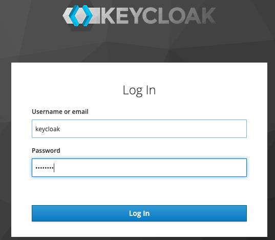

# OCP-IdP 추가

:::tip TASK DESCRIPTION
계정제공자(IdP-Identity Provider)를 추가합니다  
본 매뉴얼에서는 htpasswd와 keycloak을 설명합니다.   

[[toc]] 
:::

## htpasswd 추가 
htpasswd는 OCP자체적으로 계정을 추가할 수 있는 방법입니다.  

- **계정 등록 파일 생성**  
```
$ yum install -y httpd-tools  
$ which htpasswd  
$ htpasswd -c -B -b <파일명> <user_name> <password>  
계정 추가시에는 -c옵션 주면 안됨   
예) 
[root@bastion idp]# htpasswd -c -B -b users.htpasswd hklee passw0rd \
Adding password for user hklee \
[root@bastion idp]# htpasswd -B -b users.htpasswd sihan passw0rd \
Adding password for user sihan \
[root@bastion idp]# htpasswd -B -b users.htpasswd shlee passw0rd \
Adding password for user shlee \
[root@bastion idp]# cat users.htpasswd \
hklee:$2y$05$1ZSl07frbmRvwY2Uxuz.Cu38bTh.UMR8wAD1/i5YTOuym0yhX8F4S \
sihan:$2y$05$VF9BcY4pSPTy7uParHwZt.Qaf5agVto5EduZXmuPGwFxOyqdNRPqu \
shlee:$2y$05$Lx9qrVCFnC1weCMkOkj/jOA6kOkM49CjhnQrOOVFHmyrwhHz0b2Ta \
```

- **IdP추가**  
  - OCP webconsole로그인: 최초에는 kubeadmin으로 로그인  
  - Administration->Cluster-Settings클릭  
  - Global configuration탭 클릭하고 oAuth 클릭  
  - IdP추가: htpasswd 선택하고 위에서 생성한 파일 지정    

- **rolebinding**  
추가한 user에게 권한을 binding 합니다.  
  - OCP web console > user management > Role bindings
  - create role binding 

## ldap 추가

먼저 아래 링크 참조하여 LDAP서버 설치 및 구성합니다.  
[LDAP서버 설치 및 구성](https://kubepia.github.io/cloudpak/cp4app/install/cp4app01.html)

그리고 OCP Web console에서 IdP를 LDAP 타입으로 추가합니다.
- Administration->Cluster-Settings클릭  
- Global configuration탭 클릭하고 oAuth 클릭  
- IdP추가: LDAP 선택   

아래 화면을 참조하여 값을 지정합니다. 특히 url, attributes > id을 정확하게 지정하십시오.  
url이 맞는지 확인하려면 'curl [url]'명령을 이용하십시오.  


등록 후 YAML에서 'insecure'를 'true'로 변경하십시오.    
```
apiVersion: config.openshift.io/v1
kind: OAuth
metadata:
  annotations:
    release.openshift.io/create-only: 'true'
  creationTimestamp: '2020-07-02T04:17:40Z'
  generation: 26
  name: cluster
  resourceVersion: '129232'
  selfLink: /apis/config.openshift.io/v1/oauths/cluster
  uid: 2c5c1e08-a2b8-4684-9282-83fb5f9fa528
spec:
  identityProviders:
    - htpasswd:
        fileData:
          name: htpasswd-cw55j
      mappingMethod: claim
      name: ADMINS
      type: HTPasswd
    - ldap:
        attributes:
          email: []
          id:
            - uid
          name:
            - cn
          preferredUsername:
            - uid
        bindDN: 'cn=admin,dc=ldap,dc=kubepia,dc=com'
        bindPassword:
          name: ldap-bind-password-b5j5j
        insecure: true
        url: 'ldap://ldap.kubepia.com:389/ou=users,dc=ldap,dc=kubepia,dc=com?uid'
      mappingMethod: claim
      name: ldap
      type: LDAP
```

저장 후 namespace 'openshift-authentication'의 Pod 2개가 재생성될때까지 기다립니다.   
```
[root@ocp-infra1 ~]# oc get po -n openshift-authentication
NAME                               READY   STATUS    RESTARTS   AGE
oauth-openshift-5cff94bdcd-5kqcx   1/1     Running   0          14h
oauth-openshift-5cff94bdcd-gcvlr   1/1     Running   0          14h
```

user에 권한 부여를 위해 role binding을 합니다.   
- OCP web console > user management > Role bindings
- create role binding  
아래는 cluster-admin 권한을 부여하는 role binding 예제입니다.  


로그아웃 후 LDAP으로 로그인하는 버튼이 나올때까지 기다립니다.  
추가한 user로 로그인 테스트합니다.   


## keycloak 추가

### keycloak 설치

- **작업디렉토리 생성**  
cluster접근할 수 있는 Terminal에서 작업(예: bastion VM에서 작업)  
```sh
$ mkdir -p ~/tmp/keycloak
$ cd ~/tmp/keycloak 
```
- **namespace 생성**  
```sh
$ oc new-project keycloak
$ oc adm policy add-scc-to-user anyuid -z default 
$ oc project keycloak
```

- **helm repository 추가**  
```sh
$ helm repo add codecentric https://codecentric.github.io/helm-charts
$ helm search repo keycloak
[root@bastion ~]# helm search repo keycloak
NAME                	CHART VERSION	APP VERSION	DESCRIPTION
codecentric/keycloak	8.2.2        	10.0.0     	Open Source Identity and Access Management For ...
stable/keycloak     	4.10.1       	5.0.0      	DEPRECATED - Open Source Identity and Access Ma
```
- **helm으로 keycloak설치**  
```sh
$ helm inspect values codecentric/keycloak > config.yaml
$ vi config.yaml
...
  ## Username for the initial Keycloak admin user
  username: keycloak

  ## Password for the initial Keycloak admin user. Applicable only if existingSecret is not set.
  ## If not set, a random 10 characters password will be used
  password: "passw0rd"
...
  ## OpenShift route configuration.
  ## ref: https://docs.openshift.com/container-platform/3.11/architecture/networking/routes.html
  route:
    enabled: true
    path: /
...
  ## Persistence configuration
  persistence:
    # If true, the Postgres chart is deployed
    deployPostgres: true

    # The database vendor. Can be either "postgres", "mysql", "mariadb", or "h2"
    dbVendor: postgres
...
postgresql:
  ### PostgreSQL User to create.
  ##
  postgresqlUsername: keycloak

  ## PostgreSQL Password for the new user.
  ## If not set, a random 10 characters password will be used.
  ##
  postgresqlPassword: "passw0rd"
  ...
  ## Persistent Volume Storage configuration.
  ## ref: https://kubernetes.io/docs/user-guide/persistent-volumes
  ##
  persistence:
    ## Enable PostgreSQL persistence using Persistent Volume Claims.
    ##
    enabled: true

$ helm install keycloak -f config.yaml codecentric/keycloak -n keycloak
$ watch oc get po
Every 2.0s: oc get po                                                                                                                                Sun May 31 14:17:18 2020

NAME                    READY   STATUS              RESTARTS   AGE
keycloak-0              0/1     Init:0/1            0          12s
keycloak-postgresql-0   0/1     ContainerCreating   0          12s

```

- **keycloak 로그인**  
```sh
$ oc get route 

```
웹브라우저에서 위 주소로 접근합니다.  
config.yaml에서 지정한 id와 pw로 로그인합니다.  




### **key cloak 설정: realm, client 작성**
- **realm 작성**   
realm은 인증대상범위를 의미합니다.  


issuer주소를 clipboard에 복사해 놓습니다.  


```
예) https://keycloak-keycloak.apps.cp.kubepia.com/auth/realms/kubepia
```

public key값을 Local PC에 파일로 생성합니다. 

```
public key Sample

MIIBIjANBgkqhkiG9w0BAQEFAAOCAQ8AMIIBCgKCAQEAnXVty1Q9jiObqJYPPAGLMiPhm8a+nVncMWoL9KVO4pZPkA6PQsYcMzq+YQyHQy442p+l8d2si5ZcNgLnnfH7WtiysMxRVUHKeNtGAetSwZIb2r/WLapiEoBoXSBZ4hREWaYfZqJAzrxgpRGsl8J5MmYj0HLoXQdY6H3CuPN+770EAA411Xvr31Z9MloC4/XKO+ZxqXUk5N8cCSWvPt1hyWpG32/fqgglcKUCdbJ1P4ieYT9y8NkBzHG9+CfGJUr7Sh7goSTKiO0gAoP/b32lmTGWnmV91JcYOmGQXbkBBA8kfB0l6C+TG574sIwmChemhNeMjU6SKCvM56RqvNR7rQIDAQAB
```

- **Client 작성**  

Client는 keycloak으로 인증을 요청하는 소스 어플리케이션입니다.  


Credential값을 clipboard에 복사합니다.  


### OCP의 IdP로 keycloak 등록
등록방법 찾는중입니다.  

## User IdP 변경
User의 IdP가 변경(예: htpasswd -> LDAP)된 경우 처리에 대해 설명합니다.   
IdP가 변경된 경우 User를 삭제하고, 로그인 하려고 하면 'Cannot crete user'라는 에러가 발생합니다.   
아래와 같이 기존 User의 identities정보와 리소스를 삭제하고, 다시 로그인하면 됩니다.  

- **User identities정보 삭제**  

```
$ oc get User
$ oc edit User hklee
```
| As-Is | To-Be |
|:------|:------|
|  |  |

- **identities 리소스 삭제**  
```
$ oc get identities
$ oc delete identities admin:hklee
```

- **재 로그인**  
새로운 IdP로 다시 로그인하고 User정보를 보면 새로운 Identity정보로 변경된것을 확인할 수 있습니다.  
```
$ oc get User
$ oc get identities
```
---
<disqus/>
