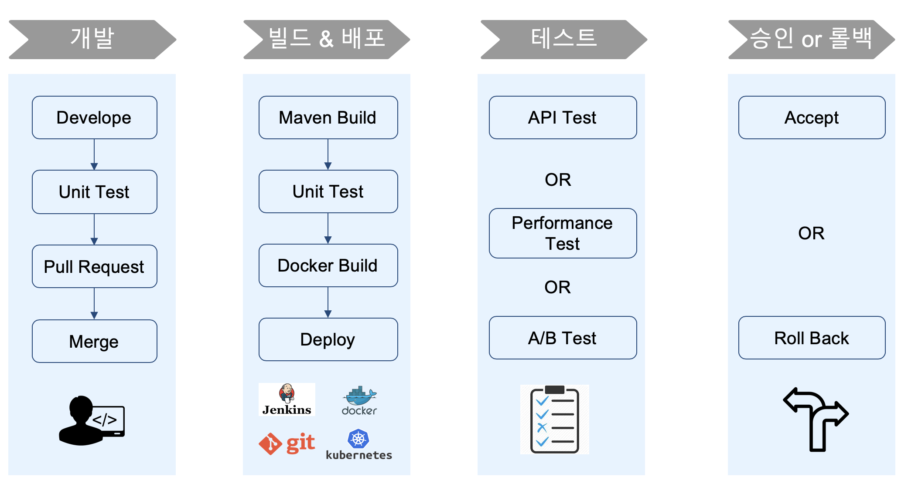

# CICD Overview

## Why CI/CD?

::: danger Problems
* Business Agility 달성을 위해 Application의 빠르고 지속적인 배포에 대한 요구 증가
* 개발과 운영 조직이 분리
* 배포로 인해 장애 발생 시 운영 조직의 책임 편중
* 배포 주기 길어짐, 배포 한번을 위해 배포 계획 수립 및 검증 작업으로 최소 몇 일 소요됨
* Application의 복잡도 증가
* 관리 대상 서비스/인스턴스 증가
:::

::: tip Solutions
* 운영환경과 동일한 Infrastructure/환경에서 테스트 수행
* 반복적인 테스트 수행 및 자동화
* Code 기반으로 Development/Staging/Production 환경에 적용
* 빠른 배포 환경
* 표준화를 통한 빌드/배포 프로세스 자동화
:::

---
[[toc]]
<disqus/>