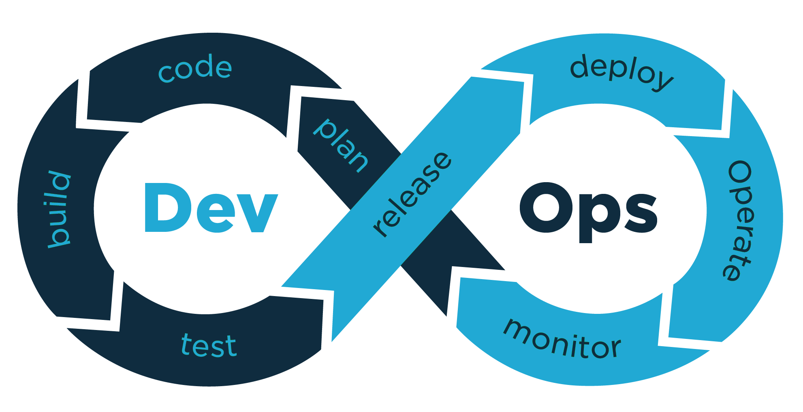
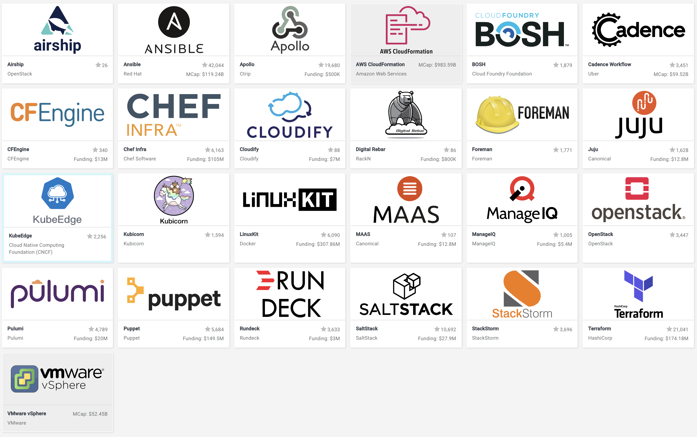
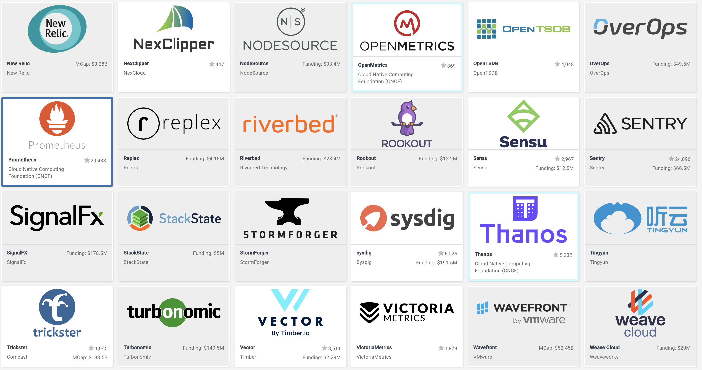
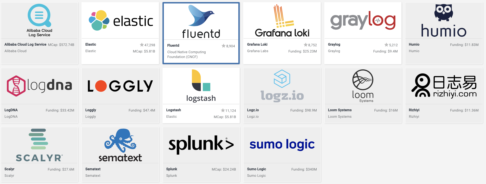

# Devops Overview

::: tip What is DevOps?
DevOps는 애플리케이션과 서비스를 빠른 속도로 제공할 수 있도록 조직의 역량을 향상시키는 문화 철학, 방식 및 도구의 조합입니다.\
DevOps 모델에서는 개발팀과 운영팀이 더 이상 "사일로"에 묶여 있지 않습니다. 때로는 이 두 팀이 단일팀으로 병합되어 엔지니어가 개발에서 테스트, 배포, 운영에 이르기까지 전체 애플리케이션 수명 주기에 걸쳐 작업하고 단일 기능에 한정되지 않은 광범위한 기술을 개발합니다.\
일부 DevOps 모델에서 품질 보증팀과 보안팀 또한 애플리케이션 수명 주기에 걸쳐 개발 및 운영과 좀 더 긴밀하게 통합됩니다. DevOps 팀 전체가 보안을  중점으로 두는 경우 때때로 DevSecOps라고 불립니다.\
이러한 팀에서는 DevOps 방식을 사용하여 속도가 느리고 수동으로 수행되던 프로세스를 자동화합니다. 또한, 애플리케이션을 안정적으로 빠르게 운영하고 
개선하는 데 도움이 되는 기술 스택과 도구를 사용합니다. 이러한 도구 덕분에 엔지니어는 이전 같았으면 다른 팀의 도움이 필요했을 코드 배포 또는 인프라 
프로비저닝과 같이 작업을 독립적으로 수행할 수 있으며, 따라서 팀의 작업 속도가 더욱 빨라집니다.
:::

## 지속적인 통합(CI)
> 지속적 통합은 자동화된 빌드/테스트 수행을 활용하고, 개발자의 업무 변경을 SCM에 병합하고 지속적으로 통합하는 개발 방식입니다.\
> CI의 핵심 목표는 버그를 신속하게 찾아 해결하고, 빠르게 테스트를 수행하여, 품질을 개선하고, 새로운 소프트웨어 업데이트를 검증 및 릴리스하는 데
> 걸리는 시간을 단축하는 것입니다.

## 지속적인 배포(CD)
> 지속적인 배포는 프로덕션에 릴리스하기 위해 일련의 작업(개발/통합/빌드/테스트/배포)을 자동으로 진행하는 소프트웨어 개발 방식입니다.
> 빌드 단계 이후의 모든 코드 변경 사항을 테스트 환경 및/또는 프로덕션 환경에 배포함으로써 지속적 통합을 확장합니다.\
> CD를 통해 언제/어디서든 빠르게 실행환경을 준비하여 검증 할 수 있습니다.

## CI/CD Tool(Open Source or Free+Comercial)

- [Jenkins](https://jenkins.io/doc/)
- [GoCD](https://docs.gocd.org/current/)
- Gitlab CI, Github Action
- Circle CI, Travis CI
- [Tekton](https://tekton.dev/)

## 인프라 자동화(Infra as a code)
> 인프라를 관리하는 방식으로 소프트웨어를 개발하는 기술을 사용하여 인프라룰 구성하고 변경/삭제 처리하는 방법 입니다.\
> 기존의 개발팀과 시스템운영팀간의 협업을 통해 수동으로 Computing 자원을 구성했던 것을 소프트웨어를 개발 기술을 활용하여 자동화화 할 수 있습니다.\
> 또한, 인프라 구성을 위해 사용했던 코드는 일반 소스코드와 같이 SCM을 통해 버전관리가 가능하며, 이를 통해 인프라 구성 또한 버전관리가 가능해 집니다.\
> 코드형 인프라는 버전 관리 및 지속적 통합과 같은 코드와 소프트웨어 개발 기술을 사용하여 인프라를 프로비저닝하고 관리하는 방식입니다.

### Infra as a code Tool
- Terraform : Provisioning
- Ansible : Provisioning
- Chef : Configuration 
- Puppet : Configuration
  
  [Ref: CNCF.io](https://landscape.cncf.io/category=automation-configuration&format=card-mode&grouping=category)

## Monitoring & Logging
> 시스템 자원 및 Application Metric 수집과 로그 수집은 최종 사용자 경험에 어떤 영향을 미치는지, Incident를 예방하고 안정적인 서비스 운영을 위한 중요한 지표를 제공합니다.\
> 이러한 지표를 통해 중요한 서비스/컴포넌트에 대한 개선과 잠재적인 병목구간을 예측하여 개선하여 최종 사용자에게 안정적인 서비스 제공을 위한 유지보수 방향성을 정할 수 있습니다.
> 지속적인 분석과 알림을 통해 능동적으로 서비스를 운영하는데 적극 활용할 수 있습니다.

### Monitoring

[Ref: CNCF.io](https://landscape.cncf.io/category=observability-and-analysis&format=card-mode&grouping=category)

### Logging

[Ref: CNCF.io](https://landscape.cncf.io/category=observability-and-analysis&format=card-mode&grouping=category)

---
[[toc]]
<disqus/>