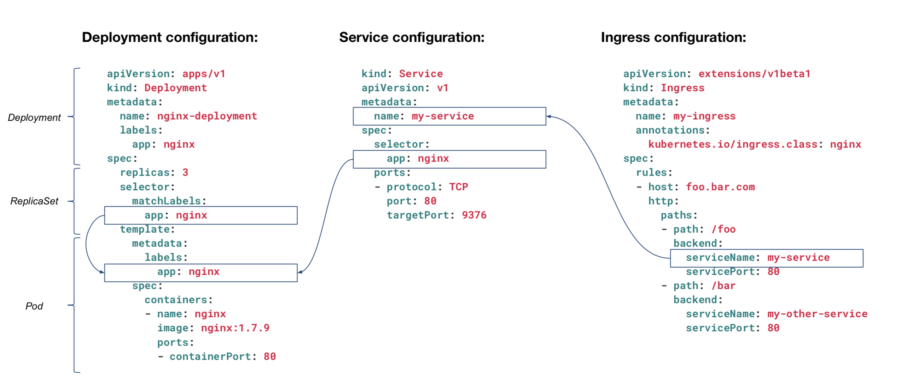
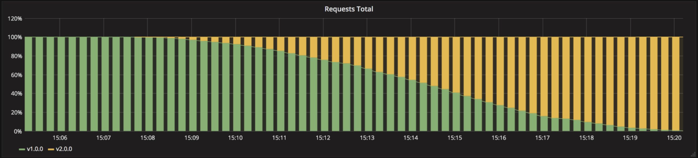
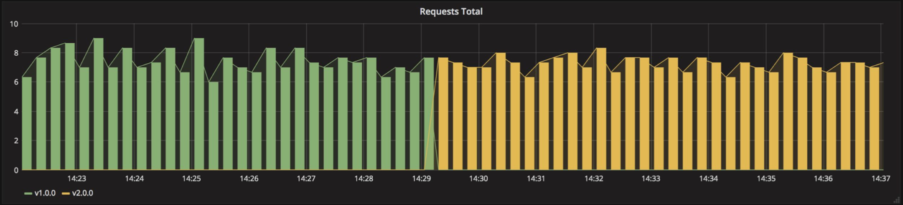
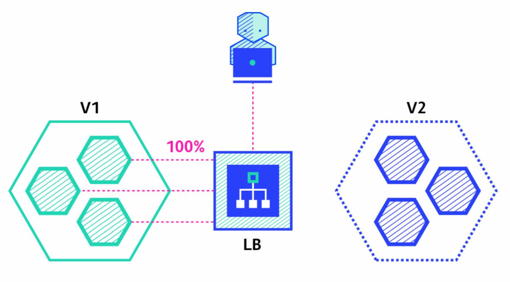
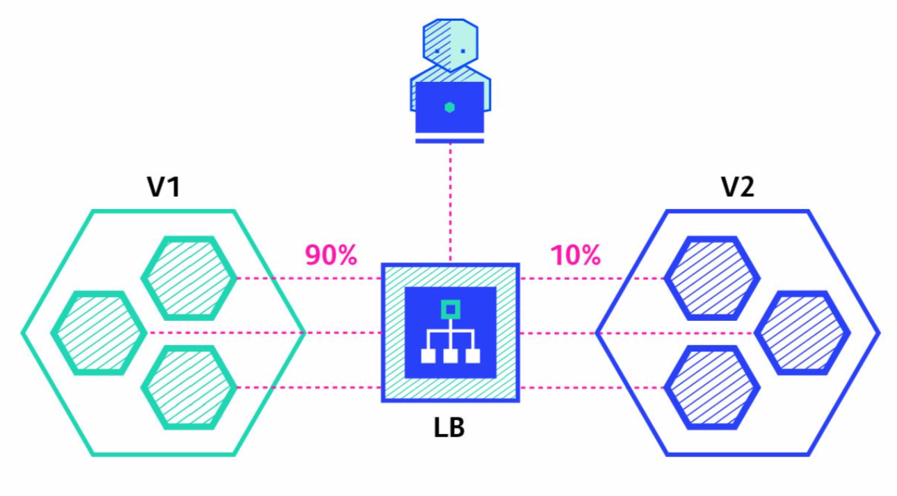
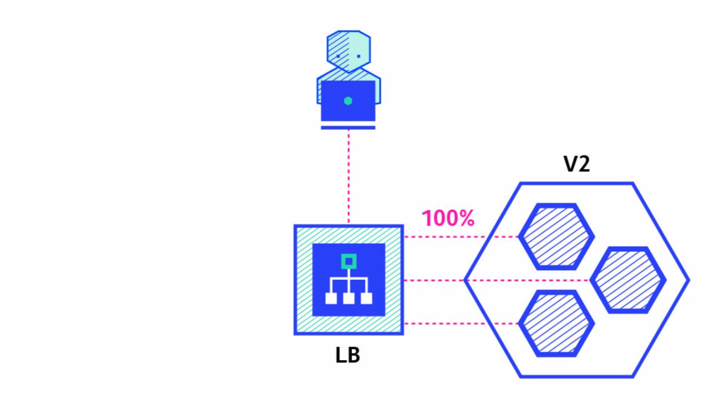
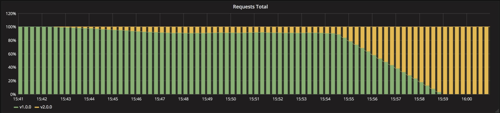
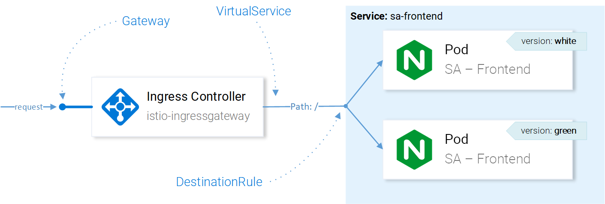

# Deploy Strategy


::: tip
* Configuration : Ingress <-> Service <-> Deployment  상호 연관 관계
* [Key]:[Value]  형태로 자유롭게 선언하여, 자원 선택시 Filter로 사용됨
:::



---
[[toc]]

---

## Recreate
> Application을 중단하고, 새로운 Application을 배포함.


| Pros          | Cons                                               |
| :------------ | :------------------------------------------------- |
| Easy to setup | High impact on the user's request. downtime exists |

Example of yaml(manifest.yaml)
``` yaml
[ . . . ]
kind: Deployment
spec:
  replicas: 3
  strategy:
    type: Recreate
[ . . . ]
```
Example of command
```
kubectl apply -f ./manifest.yaml
```

## Ramped
> (aka) : incremental, rolling update
> 신규버전의 Application Instance 점진적으로 배포하고, 기존 배포된 버전의 Instance 수를 줄여 가는 배포 방식
> Kubernetes의 History관리를 통해  Rollback 쉽게 처리 할 수 있음

| Pros                                      | Cons                           |
| :---------------------------------------- | :----------------------------- |
| Easy to setup                             | Take time for rollout/rollback |
| No downtime                               | No control over traffic        |
| Keep handling ongoing rebalancing of data |                                |

Example of yaml(manifest.yaml)
``` yaml
[ . . . ]
kind: Deployment
spec:
  replicas: 3
  strategy:
    type: RollingUpdate
    rollngUpdate:
      maxSurge: 2       # how many instances(pod) to add at a time
      maxUnavailable: 0 # unavailable number of instances(pod) 
                        # can be unavailable during the rolling update
[ . . . ]
```

Example of command
```
kubectl apply -f ./manifest.yaml
```
Traffice



## Blue/Green
> (aka) : red/black
> 신규버전의 Application Instance 배포하고, 기존 Instance에 연결되는 Routing 정보를 신규 Instance로 변경.\
> 서비스 변경이 완려되면 기존 Instane는 삭제처리함.

| Pros              | Cons                                                       |
| :---------------- | :--------------------------------------------------------- |
| Instant update    | Expensive, need double the resources                       |
| Good for frontend | Should proper test of the entire platform before releasing |

Example of yaml(manifest-v2.yaml)
``` yaml
[ . . . ]
kind: Service
spec:
# Match both the app and the version
# When switch traffic, update the label version with v2.0.0 for version 1.0.0
  selector:
    app: my-app
    version: v1.0.0
[ . . . ]
```

Example of command
```
kubectl apply -f ./manifest-v2.yaml
kubectl patch service my-app -p \
   '{"spec": {"selector": {"version": "v2.0.0"}}}'
kubectl delete -f manifest-v1.yaml
```

Traffic



## Canary
> Ramped 배포 방식과 유사하나, Instance 일부를 선배포하고, 검증 이후에
> 잔여 instance 모두를 배포하는 방식
> 선배포 검증에 실패할 경우 기존 Instance로 Rollback 처리함.

| Pros                                      | Cons                                                    |
| :---------------------------------------- | :------------------------------------------------------ |
| Verison released for a subset of users    | Slow                                                    |
| Convenient for error rate and performance | Sticky sesisons might be required                       |
| Fast rollback                             | need traffic control required like *istio* or *linkerd* |

|   1   |  |
| :---: | :--------------------------------: |
|   2   |  |
|   3   |  |

Traffic


## Request Mapping
> Canary 배포와 같이 여러종류의 version을 배포하고, 요청되는 http의 header 정보를 활용하여 version을 선책해서 처리하는 방식.\
> A/B Test와 같이 Production 환경에서 실사용자 대상으로 기능 또는 마케팅을 검증하고 선별적인 서비스를 제공하기 위한 배포 기술임.\

::: danger 조건
A/B Test를 위해서는 service controll을 위한 service mesh(istio, kong etc) 기능을 추가로 설치해야함
:::



## Summary
* recreate if downtime is not a problem
* recreate and ramped doesn’t require any extra step (kubectl apply is enough)
* ramped and blue/green deployment are usually a good fit and easy to use
* blue/green is a good fit for front-end that load versioned assets from the same server
* blue/green and shadow can be expensive
* canary and a/b testing should be used if little confidence on the quality of the release
* canary, a/b testing and shadow might require additional cluster component

---
[[toc]]
<disqus/>