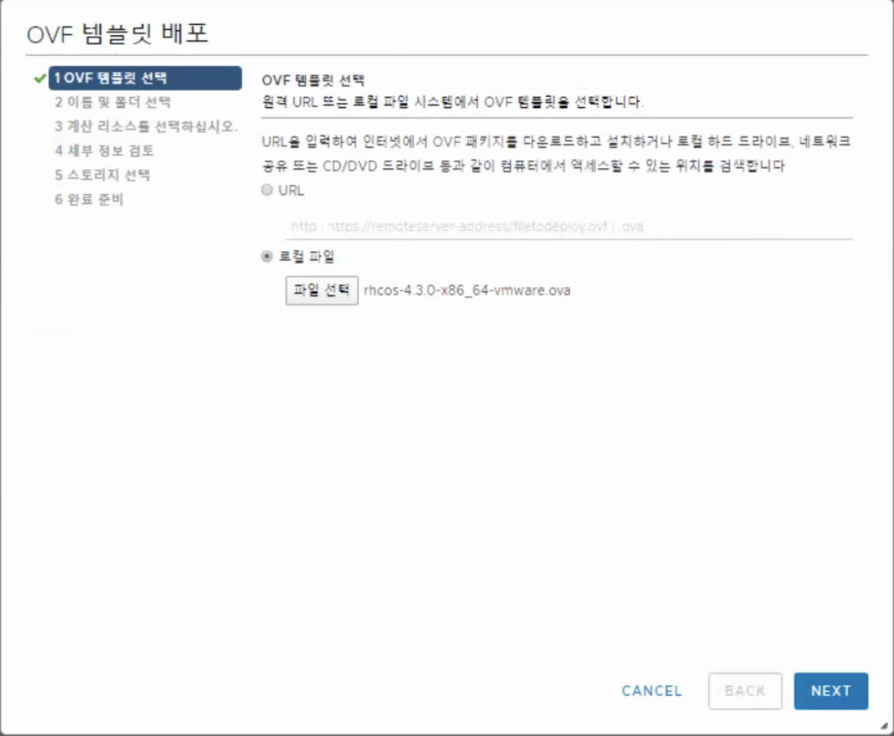
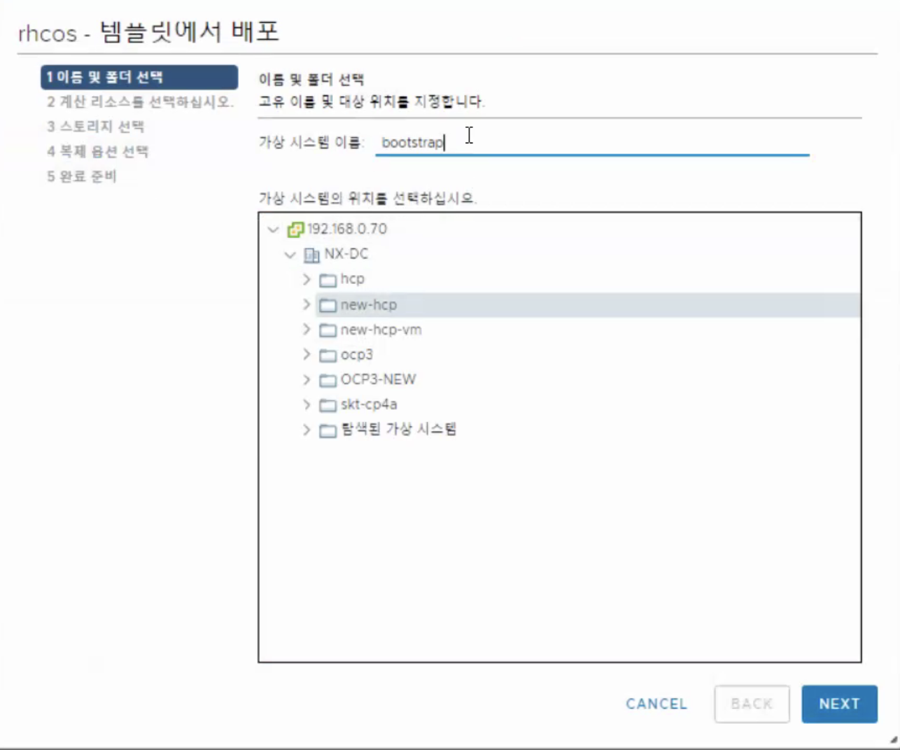
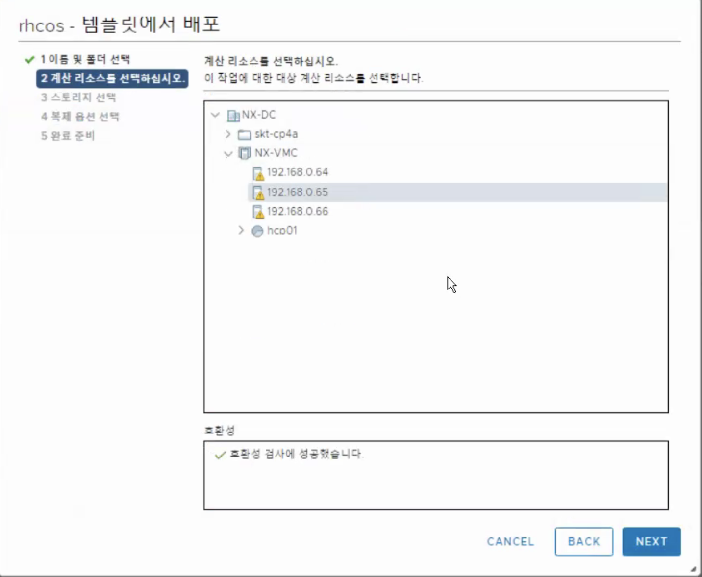
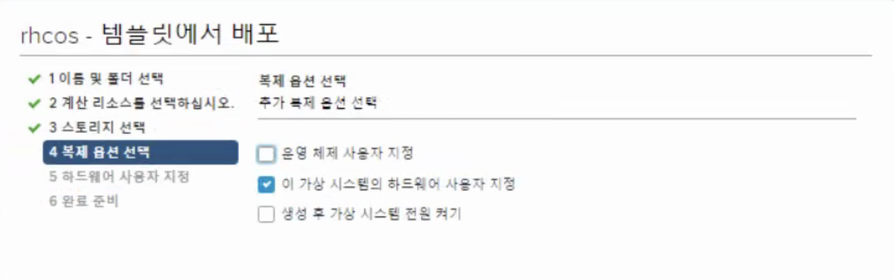
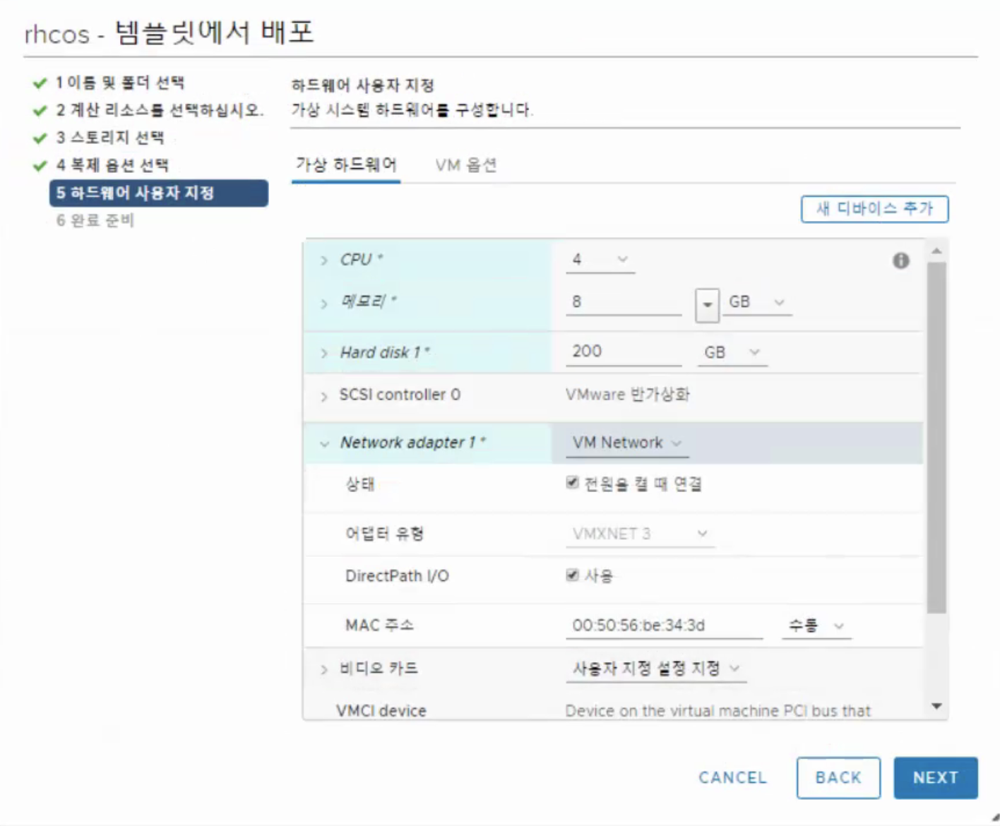
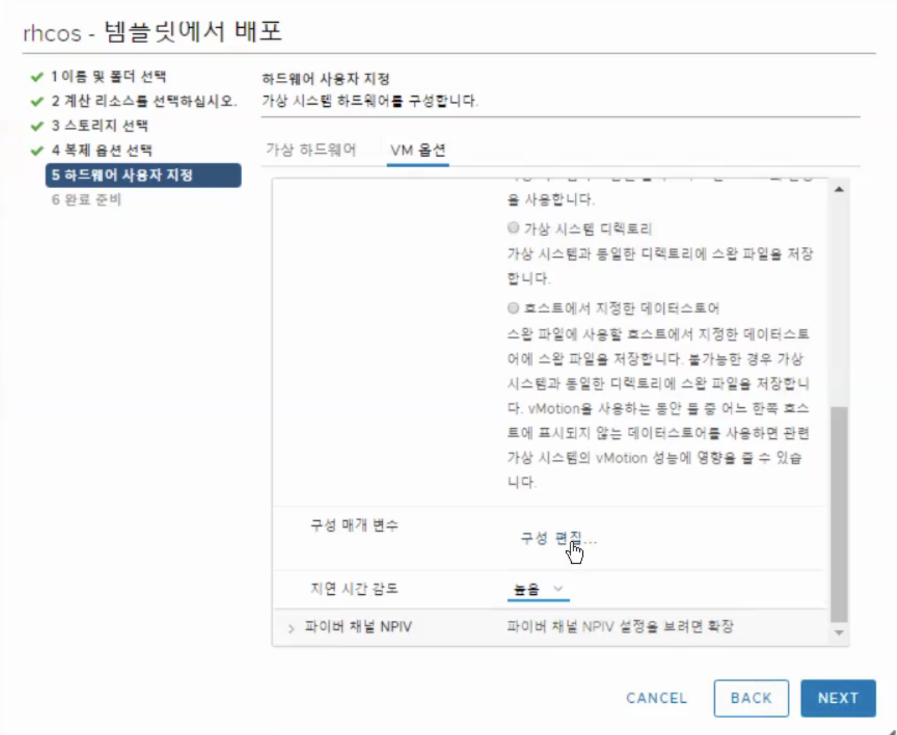
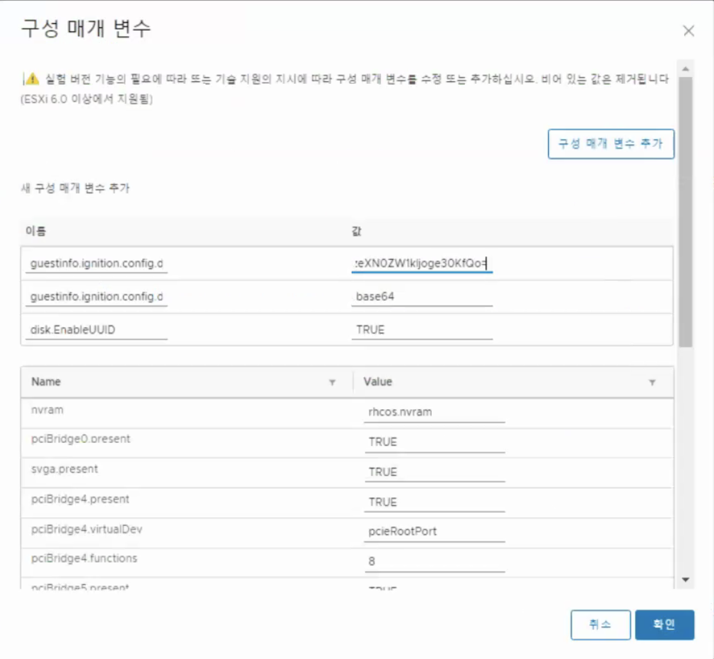

# Install-UPI

## Preparation

- Get subscription (login 필요) from [redhat](https://cloud.redhat.com/openshift/install/vsphere/user-provisioned)
- Get quay.io pull secret from [redhat](https://cloud.redhat.com/openshift/install/vsphere/user-provisioned)
- ssh key 생성 : ssh-keygen -t rsa -b 4096 -N '' -C [kubepia]
- download : openshift-installer, RHCOS
- 동일한 Subnet으로 필요한 VM 구성 후 필요 소프트웨어 설치/설정 : DNS, Web, HAProxy, DHCP
  
## Setup Web server
> Use bastion server
> Install httpd or nginx

## manifest 생성

### create file : install-config.yaml
``` yml
apiVersion: v1
baseDomain: darumtech.net
compute:
- hyperthreading: Enabled
  name: worker
  replicas: 3
controlPlane:
  hyperthreading: Enabled
  name: master
  replicas: 3
metadata:
  name: hcp
platform:
  vsphere:
    vcenter: 192.168.0.70
    username: administrator@vsphere.local
    password: [password for vshpere]
    datacenter: [name of data center]
    defaultDatastore: [name of data store]
fips: false
```

### ignition file 생성

- backup install-config.yaml
- mkdir install path : /install/config
  ``` shell
  openshift-install create ignition-configs --dir=/install/config
  ```
- generated : auth  bootstrap.ign  install-config.yaml.org  master.ign  metadata.json  worker.ign
- create append for bootstrap : append-boostrap.ign
  ``` json
  {
    "ignition": {
      "config": {
        "append": [
          {
            "source": "http://[webserver url]/install/bootstrap.ign",
            "verification": {}
          }
        ]
      },
      "timeouts": {},
      "version": "2.1.0"
    },
    "networkd": {},
    "passwd": {},
    "storage": {},
    "systemd": {}
  }
  ```
- copy to web server(/[webroot]/install) : append-bootstrap.ign  bootstrap.ign  master.ign  worker.ign
- encode for vmware configuration : append-bootstrap.64, master.64, worker.64
  ``` shell
  for i in append-bootstrap master worker
   do
   base64 -w0 < $i.ign > $i.64
  done
  ```
## vm 생성(vshpere)

### Template 생성

> Use Thin Provision
> Use downloaded RHCOS*.ova



### Bootsrap VM from Template

1. 폴더 선택
  
2. Resource 설정
  
  
3. HW 설정 : DHCP 에서 설정된 MAC 주소를 지정해야함
   
4. VM Option
   
   1. Parameter 추가 : guestinfo.ignition.config
      - bootstrap: append-bootstrap.64 파일 내용
      - master : master.64 파일내용
      - worker : worker.64 파일내용
   2. Parameter 추가 : guestinfo.ignition.config.data.encoding
      > base64
   3. Parameter 추가 : disk.EnableUUID
      > TRUE
   
5. master 3대, worker 반복

### Cluster 생성 확인 방법

``` shell
openshift-install --dir=/install/config wait-for bootstrap-complete --log-level=debug
```