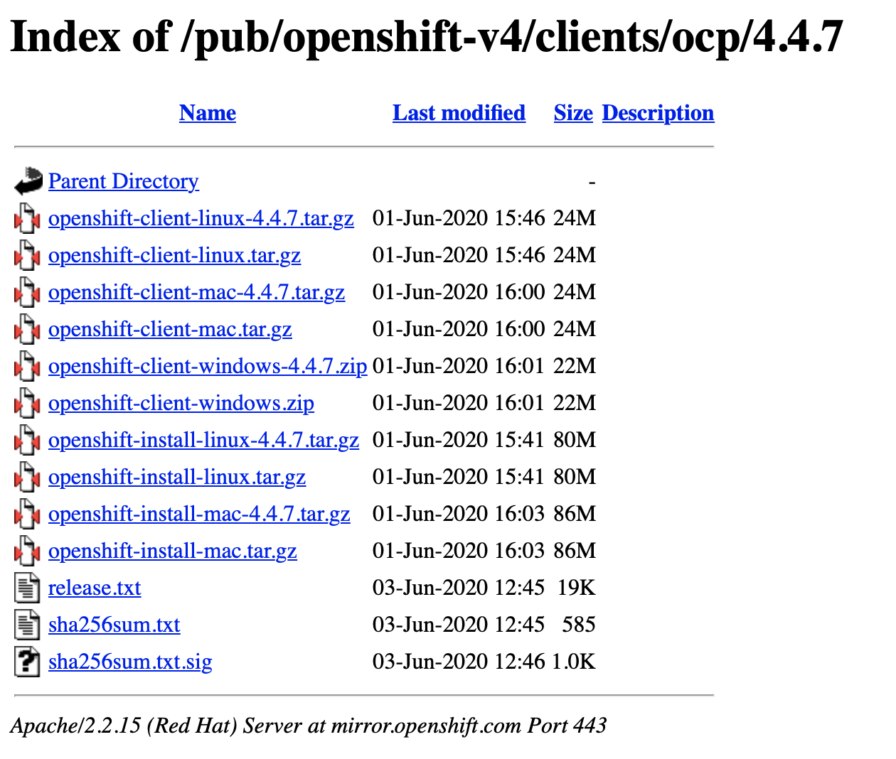

# Mirror registry
:::tip Ref
Redhat Document : [](https://docs.openshift.com/container-platform/4.4/installing/install_config/installing-restricted-networks-preparations.html)
:::

## Preparing the bastion host
> 설치에 필요한 Container를 Mirror하는데 인터넷이 연결되는 서버가 필요하며, \
> Mirror된 이후 내부 서버와도 연결이 가능해야 합니다.

- 필요 software : oc cli, podman, httpd-tools
- directory : /opt/registry/{auth,certs,data}
- ssh key : 사설 인증서 사용 가능( container pull 등에 TLS 인증 해제 설정이 필요함)
  ``` shell
  cd /opt/registry/certs
  openssl req -newkey rsa:4096 -nodes -sha256 -keyout domain.key -x509 -days 365 -out domain.crt
  ```

## Mirroring

### Install SW

1. oc cli : 작업 환경에 맞는 [ocp 4.4.7 client](https://mirror.openshift.com/pub/openshift-v4/clients/ocp/4.4.7/)를 다운로드 받고 압축을 푼다.
  
2. install podman : container 작업(pull/push/run etc)을 위한 tool
3. install httpd-tools : container registry secret을 httppwd 기본인증으로 생성하기 위한 Tool(다른 tool 사용 가능)
   ```shell
   sudo yum install -y podman httpd-tools

   ```
### Mirror Registry 실행

1. Containre Registry를 위한 SSL Keys into **/opt/registry/certs**
2. Container Resgistry ID/Password 파일 생성 : 예) admin|passw0rd
   ```shell
   # htpasswd -bBc /opt/registry/auth/htpasswd admin passw0rd
   ```
3. Run Mirror-Registry 실행 : OCP 설치를 위한 Container를 Mirror 하기 위한 Registry를 실행한다. 예) host: https://registry.kubepia.net:5000 
   ```shell
   podman run --name mirror-registry -p 5000:5000 \
     -v /opt/registry/data:/var/lib/registry:z \
     -v /opt/registry/auth:/auth:z \
     -e "REGISTRY_AUTH=htpasswd" \
     -e "REGISTRY_AUTH_HTPASSWD_REALM=Registry Realm" \
     -e REGISTRY_AUTH_HTPASSWD_PATH=/auth/htpasswd \
     -v /opt/registry/certs:/certs:z \
     -e REGISTRY_HTTP_TLS_CERTIFICATE=/certs/domain.crt \
     -e REGISTRY_HTTP_TLS_KEY=/certs/domain.key \
     -e REGISTRY_COMPATIBILITY_SCHEMA1_ENABLED=true \
     -d docker.io/library/registry:2
   ```
4. 다른 VM에서 접근 테스트: 사성 인증서를 적용한 경우 -k 옵션 사용
  ```shell
  # curl -u admin:passw0rd  -k https://registry.kubepia.net:5000/v2/_catalog
  {"repositories":[]}
  ```
5. (Option) 사설인증서를 사용한 경우 작업 VM에 Trust 설정
   ```shell
   # cp /opt/registry/certs/domain.crt /etc/pki/ca-trust/source/anchors/
   # update-ca-trust
   ```

### Pull secret 설정

1. Download Pull secret from [Redhat login required](https://cloud.redhat.com/openshift/install/pull-secret)
   ``` json
   {
      "auths": {
        "cloud.openshift.com": {
          "auth": "b3BlbnNo...",
          "email": "you@example.com"
        },
        "quay.io": {
          "auth": "b3BlbnNo...",
          "email": "you@example.com"
        },
        "registry.connect.redhat.com": {
          "auth": "NTE3Njg5Nj...",
          "email": "you@example.com"
        },
        "registry.redhat.io": {
          "auth": "NTE3Njg5Nj...",
          "email": "you@example.com"
        }
      }
    }
    ```
2. Mirror Registry Secret 생성(base64 encoding)
   ```shell
   # echo -n 'admin:passw0rd' | base64 -w0
   YWRtaW46cGFzc3cwcmQ=
   ```
3. Mirror Registry Secret 추가 : /opt/registry/certs/pull-secret.json
   ```json
   {
      "auths": {
        "cloud.openshift.com": {
          "auth": "b3BlbnNo...",
          "email": "you@example.com"
        },
        "quay.io": {
          "auth": "b3BlbnNo...",
          "email": "you@example.com"
        },
        "registry.connect.redhat.com": {
          "auth": "NTE3Njg5Nj...",
          "email": "you@example.com"
        },
        "registry.redhat.io": {
          "auth": "NTE3Njg5Nj...",
          "email": "you@example.com"
        },
        "registry.kubepia.net:5000":{
          "auth": "YWRtaW46cGFzc3cwcmQ",
          "email": "you@example.com"
        }
      }
    }
    ```

### Mirroring

1. 환경변수 설정 : 
   1. OCP_RELEASE : 설치할 OCP 버전 지정 예) 4.4.7. 다음 싸이트에서 선택 [Repo list](https://quay.io/repository/openshift-release-dev/ocp-release?tab=tags)
   2. LOCAL_REGISTRY : Mirror Registry URL 예) registry.kubepia.net:5000
   3. LOCAL_REPOSITORY : Registry Repository Name 예)ocp4/openshift4
   4. PRODUCT_REPO : predefined 예) openshift-release-dev
   5. LOCAL_SECRET_JSON : pull secret file path 예) /opt/registry/certs/pull-secret.json
   6. RELEASE_NAME: predefined 예)ocp-release
   ```shell
   export OCP_RELEASE="4.4.6-x86_64" 
   export LOCAL_REGISTRY='registry.kubepia.net:5000' 
   export LOCAL_REPOSITORY='ocp4/openshift4' 
   export PRODUCT_REPO='openshift-release-dev' 
   export LOCAL_SECRET_JSON='/opt/registry/certs/pull-secret.json' 
   export RELEASE_NAME="ocp-release"
   ```
2. Run mirror : oc adm
   ```shell
   oc adm -a ${LOCAL_SECRET_JSON} release mirror \
      --from=quay.io/${PRODUCT_REPO}/${RELEASE_NAME}:${OCP_RELEASE} \
      --to=${LOCAL_REGISTRY}/${LOCAL_REPOSITORY} \
      --to-release-image=${LOCAL_REGISTRY}/${LOCAL_REPOSITORY}:${OCP_RELEASE} 
   ```
